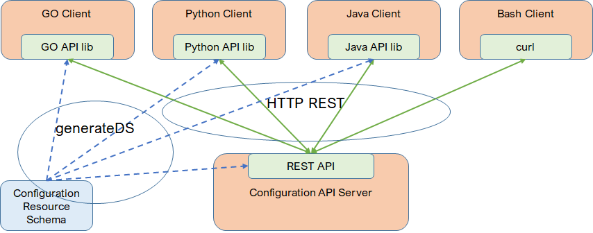

# API Guide - Configuration

# 1 Overview

Tungsten Fabric (TF) provides a REST API for user to manage configurations. REST API is natively supported by configuration API server. Other than REST API, some language API are also provided, like Python, GO and Java.

## 1.1 Data Model

In TF, all resources, their properties and relations are defined by data model in XML Schema Definition (XSD) format. Configuration resource is defined in [vnc_cfg.xsd](https://github.com/Juniper/contrail-api-client/blob/master/schema/vnc_cfg.xsd). `vnc_cfg.xsd` is packed in contrail-config package and installed in `/usr/share/doc/contrail-config/doc` directory in container `config_api_1`.

## 1.2 API Server

Configuration API server provides REST API support. Client connects to API server to operate configuration objects by REST API.

API server works in either authentication mode or non-authentication mode. In authentication mode, API server connects to authentication server to authenticate each request. Only requests from authenticated user are accepted. Currently, OpenStack Keystone service is supported as the authentication service. In non-authentication mode, any request from any user is accepted.

The backend of API server is the Cassandra database for storing all configuration data.

## 1.3 Integration

TF can work alone without any orchestration. Client can connect to API server directly to manage configurations. TF can also be integrated with other orchestration/stack application. In case of the integration with OpenStack, OpenStack Neutron Plugin acts as the client of API server and connect frontend Neutron and backend OpenContrail together. Neutron database is not required. All networking data is stored at single place that is the TF database.

# 2 REST API

[API Guide - Configuration REST API](Configuration-REST.md#api-guide---configuration-rest-api)

# 3 Python API

[API Guide - Configuration Python API](Configuration-Python.md#api-guide---configuration-python-api)

# 4 GO API

Here is the [GO API](https://github.com/Juniper/contrail-go-api) on GitHub.

# 5 Java API

# 6 Heat

