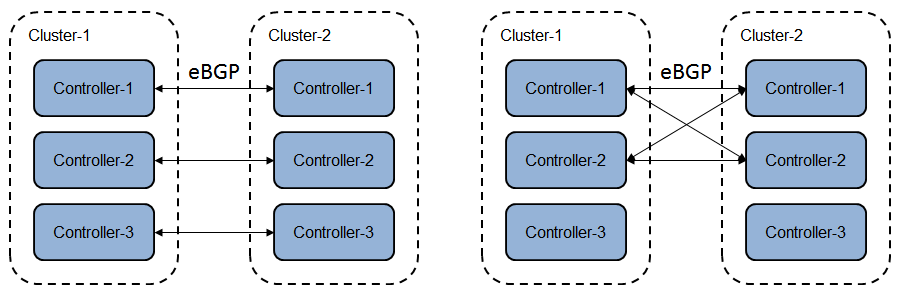
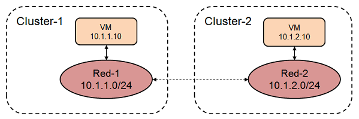
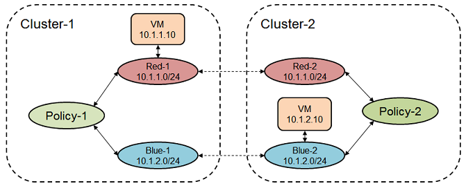

# 1 Overview

Cluster federation is one option to connect multiple clusters, where control nodes in one cluster peer with control nodes in another cluster directly. This requires IP reachability between clusters. Each cluster must have an unique ASN.

# 2 Peer Control Nodes

Since each cluster has an unique ASN, it will be eBGP that doesn't require fully meshed peering. For HA (high availability) purpose, two options are recommended. Assume there are 2 clusters and 3 control nodes in each cluster.
  * One to one peering, 11 and 21, 12 and 22, 13 and 23.
  * Pick 2 control nodes from each cluster and fully mesh them.

# 3 Connect Networks

When a virtual network is created, a system RT (route target) is allocated as both import and export RT. The system RT consists of local ASN and an integer starting from 8000000. Since the same integer may be allocated by different cluster, unique ASN for each cluster is required to avoid RT overlap on control plane.

To connect two virtual networks, an user RT (ASN and integer less than 8000000) is specified by user as both import and export RT. Then associate the same RT to both virtual networks in two clusters. The ASN of this user RT can be the ASN of any cluster or something else, doesn't matter. Because of this RT, routes in two virtual networks from two clusters will be propagated between each other.

## 3.1 L2 Connection

This is to connect VNs with the same subnet, but different allocation pools to avoid address overlap. Since address family e-vpn and erm-vpn are configured for BGP peer. MAC address will be also advertised along with IP address. Vrouter will be the ARP proxy.

Since this is L2 connection, there is no network policy on traffic.

SG has to be configured properly to allow traffic go through. Each SG has an ID (combination of local ASN and integer). When creating SG, the SG ID can be either allocated by system or specified by user. The integer of system SG ID is >= 8000000. The integer of user SG ID shall be < 8000000. SG ID is propagated along with route as a community by BGP on control plane. When route comes down to vrouter from CN, only the integer of SG ID comes along. Also, the system SG ID with remote ASN doesn't come down to vrouter to avoid system SG ID collision across clusters.

In case of OpenStack integration, there is a defaut SG on each VM interface. One of ingress rules is to allow the traffic from the same SG. But for the traffic from another cluster, the source route doesn't have SG ID (system SG ID from remote ASn doesn't come down to vrouter). So the traffic won't be allowed. To make it work, an user SG with the same integer (< 8000000) has to be created in each cluster and attached to VM interface. Then the traffic will be allowed by this user SG. Another option is just to modify the rule in default SG to allow the traffic.

## 3.2 L3 Connection

### 3.2.1 Sbunet

This is to connect subnets of the same VN from different clusters. Similar to L2 connection, attach the same RT to the same VNs to connect them. The traffic will be routed between subnets. There is no network policy applied.

### 3.2.2 Virtual Network

This is to connect different VNs from different clusters. For example, to connect VN red1 in cluser1 and VN blue2 in cluster2, create red2 in cluster2 and blue1 in cluster1. Then use RT to connect red1 and red2, blue1 and blue2, just like L2 connection. Then create policy1 in cluster1 and attach it to red1 and blue1. The same for cluster2, create policy2 and attach it to red2 and blue2.

