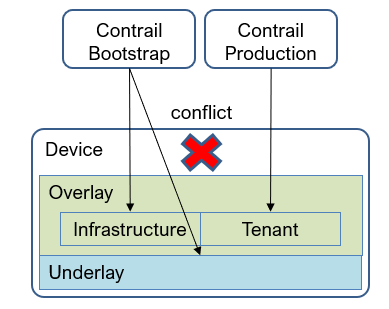
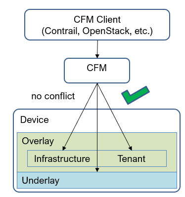

# 1 Overview

This guide is to provide solution for device management. The focus is on configuration workflow, not statistics collection and monitoring.

There are 3 layers to manage.
1. Underlay, providing underlay IP connectivity based on IP fabric
2. Infra-overlay, providing overlay connectivity based on EVPN-VXLAN to support multi-homing and subnet spanning on multiple racks
3. Tenant-overlay, providing overlay connectivity for tenant workload including VM, container, SRIOV VM, BMS and VLAN

# 2 Current release

With the current release, the solution with single Contrail cluster is recommended.

* Underlay and infra-overlay are managed manually, or with some 3rd party tool.
* Contrail is deployed on underlay and infra-overlay.
* Fabric is created in Contrail by importing devices, AKA greenfield.
* Tenant-overlay is managed by Contrail.
* For devices connecting both infracture hosts and tenant workload, they will be managed by two services (device management tool and Contrail). Resource (ASN, VNI, RT, etc.) allocation has to be planed ahead to avoid conflict.

The solution with two Contrail clusters, one for underlay and infra-overlay and another for tenant-overlay, is not recommended. Because it's difficult to manage the conflict between to cluster when they manage the same device for different layers.

# 3 Release with improvements

With some improvements, BMS and SRIOV VM will be supported with OpenStack interface. But it won't resolve the conflict. The single cluster solution is still recommended.

# 4 CFM

There is effort to build a separated product, CFM, specifically for fabric management. All 3 layers will be managed by single service. This will avoid conflicts. When device management is required by Contrail to support tenant workload, Contrail will connect to CFM who in turn manages devices. Contrail won't touch devices directly.

With CFM, all fabric related operations, configuration, statictics collection, monitoring, telemetry, etc. will be handled by single service. Contrail will be a client of CFM if any device related operations are required.

