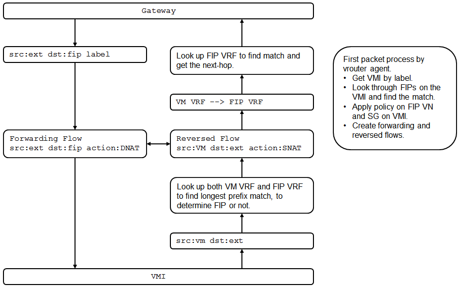

#1 Overview

#2 Control Plane

#3 Data Plane

##3.1 Create Flows
The first packet of the flow is forwarded to vrouter agent for creating forwarding and reversed flows.

###3.1.1 Ingress
Session is initiated by external user to VM using FIP.

* The packet is src:ext dst:fip. The MPLS label is the interface lable.
* Agent takes the interface label, gets the VMI, gets all FIPs associated to that VMI (multiple FIPs can be associated to one VMI.), looks for the match of destination in the packet, to determine if it's FIP traffic.
* The network policy of FIP VN and VM SG are applied.
* The forwarding flow is src:ext dst:fip action:dnat
* The reversed flow is src:vm dst:ext action:snat

###3.1.2 Egress
Session is initiated by VM to external using FIP.
* The packet is src:vm dst:ext.
* Agent gets the VMI. If there is FIP associated to VMI, vrouter will look up both VM VRF and FIP VRF to get the longest prefix match, to determine if it's FIP traffic.
* The network policy of FIP VN and VM SG are applied.
* The forwarding flow is src:vm dst:ext action:snat
* The reversed flow is src:ext dst:fip action:dnat

##3.2 Forward Packet
Once the forwarding and reversed flows are created based on the first packet, the rest packets of the flow will just hit the flow and follow the action.

###3.2.1 Ingress
Session is initiated by external user to VM using FIP.

For forwarding flow, vrouter
* takes the source of reversed flow (VM) and use it for DNAT (replace FIP with VM),
* sends the traffic to the interface identified by interface lable (no route lookup).

For reversed flow, vrouter
* takes the destination of forwarding flow (FIP) and use it for SNAT (replace VM with FIP),
* translates VRF from VM VRF to FIP VRF,
* looks up FIP in VIP VRF to get the match and the next-hop, which should be the GRE tunnel to GW.

###3.2.2 Egress
Session is initiated by VM to external using FIP.

For forwarding flow, vrouter
* takes the destination of reversed flow (FIP) and use it for SNAT (replace VM with FIP),
* translates VRF from VM VRF to FIP VRF.
* looks up FIP in VIP VRF to get the match and the next-hop, which should be the GRE tunnel to GW.

For reversed flow, vrouter
* takes the source of forwarding flow (VM) and use it for DNAT (replace FIP with VM),
* sends the traffic to the interface identified by interface lable (no route lookup).

