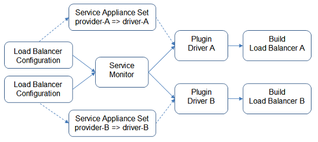
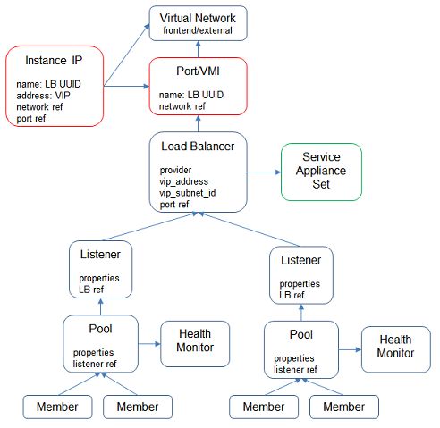

# 1 Overview

Contrail LBaaS implementation is based on plugin model. It provides an interface for LB driver to work with Contrail. It supports 3rd party LB driver to manage their own LB device.

## 1.1 Workflow

* Servce Appliance Set is to define LB provider and specify driver location.
* When LBaaS is configured, service monitor will take the configuration updates and invoke driver to update LB.

## 1.2 Configuration Object

There are 2 options to create LBaaS.
1. By OpenStack (Neutron) API, in this case, instance IP and port/VMI will be configured by Neutron Contrail LBaaS Plugin, service appliance set has to be configured by Contrail configuration API.

2. By Contrail configuration API, in this case, all objects have to be configured by user.

# 2 Driver

The provider can be specified, when create a loadbalancer. By default, the provider is "opencontrail". Each provider links to a service appliance set where the provider specific driver is specified. Then service monitor takes loadbalancer configuration and call the driver to build the loadbalancer.

Multiple drivers can co-exist. Each driver builds its own loadbalancer. So multiple loadbalancers of the same or different providers can co-exist.

There are two pre-configured provider, "opencontrail" and "native".

## 2.1 opencontrail

This driver creates the loadbalancer based on HAProxy.

## 2.2 native

This diver creates the loadbalancer based on vrouter ECMP support.

## 2.3 Third party

Any other vendor can develop the driver for their LB device. F5 LTM is an example.

# 3 OpenStack

When integrate with OpenStack, Neutron LBaaS v2 is supported.

# 4 Kubernetes

When integrate with Kubernetes, service is supported by provider "native" and ingress is supported by provider "opencontrail".

