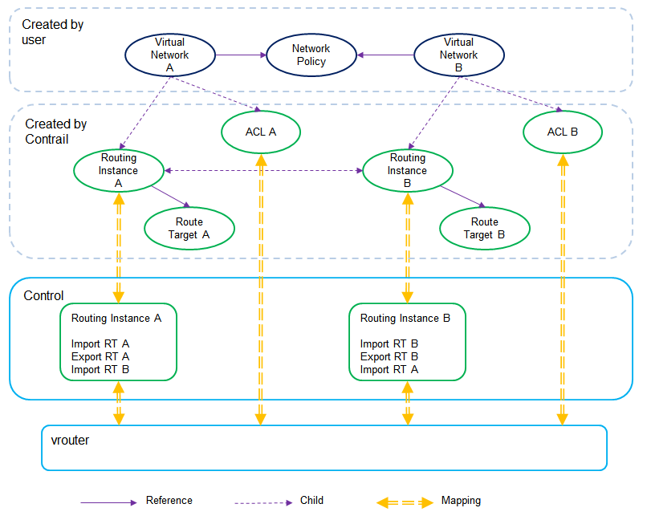
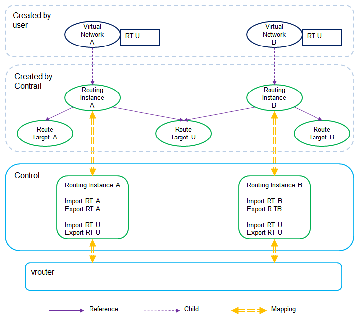

## 1 Overview

Contrail provides connection and security.

```
+---------------+-----------+------------+----------+
|               |  Network  |  Security  |  Route   |
|               |  Policy   |  Group     |  Target  |
+---------------+-----------+------------+----------+
| Network L3    |     X     |            |    X     |
| Connection    |           |            |          |
+---------------+------------------------+----------+
| Filtering on  |     X     |            |          |
| Network       |           |            |          |
+---------------+-----------+------------+----------+
| Filtering on  |           |     X      |          |
| Interface     |           |            |          |
+---------------+-----------+------------+----------+
```
Network L2 connection is achieved by BGP EVPN to advertise MAC route. Network L3 connection is achieved by BGP L3VPN to leak route between L3 networks based on route target. This is confiugred by network policy.

Security is about traffic filtering on both network and port/interface. Security on network is defined by network policy, and securiy on interface is defined by security group.


## 2 Network Policy

Network policy defines network L3 connection and filtering.

Network L3 Connection means routes in virtual networks are propagated between each other, so the address of one virtual network is visible in other connected virtual networks. There are two options to connect networks, network policy and route target. It's recommended to use network policy, instead of manipulating route targets.

To connect virtual networks by network policy, user creates virtual networks and network policy, and attach network policy to virtual networks. Contrail also builds some configurations to make it work. See figure 1.




### 2.1 System Route Target

After user created a vritual network, Contrail (schema transformer) will allocate a system route target for both import and export, and create a routing instance for that virtual network. The route target format is target:&ltASN&gt:&ltinteger&gt. The integer for system route target starts from 8000000.

After the network policy is attached to a virtual network, Contrail (schema transformer) will create an ACL (child object of network) and update routing instance to refer to other routing instance who has the same network policy attached (link two routing instances). Once two routing instances are linked, the peer export RT will be added into the list of import RTs.


### 2.2 ACL

There is only one ACL for each virtual network. The ACL is created or updated by Contrail schema transformer when policy is attached to virtual network. All rules from all attached policies will be aggregated into this single ACL.


### 2.3 Static vs. Dynamic

A policy can be attached to a virtual network as either static or dynamic.

By default, it's static. ACL will be created or updated as described in 2.2.

Policy is attached as dynamic with a property of timer. For now, no need to configure any values for the timer. In this case, a dynamic ACL will be created for all dynamic policies.

The order of rules in ACL is determined by the order of rules in each policy and the oder of policy attachment to virtual network. The order matters to static ACL. Once the packet hits a rule, the action will be taken, and no any other rules going to be evaluated. For dynamic ACL, all rules will be evaluated and action will be taken if there is a hit.

Mirror rule is an example of dynamic rule. When attaching a mirror policy (including mirror rule) to a virtual network, the mirror rule is always evaluated no matter what other policies on that virtual network.


## 3 Route Target

Route target is for controlling route leaking between virtual networks. There is no ACL when using route target to connect virtual networks. See figure 2.



Other than the route target allocated to the virtual network during creation, user route target can be added. For example, to allow route exchange between two virtual networks, the same route target (import and export) is added into those two virtual networks. Then the route target goes to the list of import route target and the list of export route target in both routing instances.

To do one-way route leaking from virtual network A to virtual network B, add a route target (import and export) to A and add the same route target (import) to B.


## 4 Security Group

The SG ACL is derived from security group configuration. Remote SG can be specified as a criterion in a rule.


## 5 Workflow in vRouter

On data plane (vrouter), traffic filerting is controlled by ACLs that are derived from network policy and security group.

When vrouter forwarding module gets the first packet, it creates a flow and sends the packet to vrouter agent. When vrouter agent gets the packet, it applies both SG ACL and network ACL first, then looks up VRF to get the next hop. If any deny in ACLs is hit or lookup failed, the flow action will be drop. Otherwise, the action will be accept. Then vrouter forwarding will just execute the action set by vrouter agent.

For ingress traffic, given the MPLS label (identify interface), vrouter gets the interface. Then vrouter gets the destination VRF that interface belongs to. For egress traffic, vrouter knows from which interface the traffic is originated. Vrouter will get the source VRF that interface belongs to. In either ingress or egress case, both routes of source address and destination address should be in the destination VRF or source VRF respectively. Because route exchange is the first requirement to connect networks, then is the ACL.


### 5.1 Security Group ACL

* Ingress
  * Open port, check if the port in the packet is allowed.
  * Remote CIDR, check if the source address is allowed.
  * Remote SG, check if the SG is in the SG list of the source route. Vrouter looks for source address in destination VRF. The route should be propagated there from source network by routing protocol. Otherwise, packet won't get here at all. SG ID (combination of ASN and integer) is propagated along with route as community.

* Egress
  * Open port, check if the port in the packet is allowed.
  * Remote CIDR, check if the destination address is allowed.
  * Remote SG, check if the SG is in the SG list of destination route. Vrouter looks for destination address in source VRF. The route should be propagated there from destination network by routing protocol.


### 5.2 Network Policy ACL

* Ingress
  * Vrouter looks for source address and destination address in destination VRF to find out the source network and destination network. Then check against to the source network and destination network settings in the rule.

* Egress
  * Vrouter looks for source address and destination address in source VRF to find out the source network and destination network. Then check against to the source network and destination network settings in the rule.

