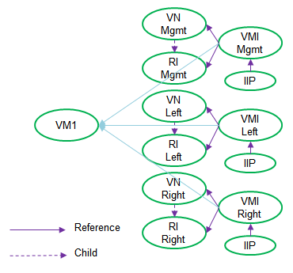

## Overview
A service chain consists of multiple service instances, a pair of left and right virtual networks as the minimum for firewall type service, and a service policy. See Figure 1.


A chain can have mixed in-network (L3) service and transparent (L2) services. In-network-nat service has to be the last (the most right) service in the chain. When launch VM for in-network service instance, it has to be on the left and right virtual networks where the service policy will be attached. For VM for transparent service instance, it has to be on some other left and right virtual networks.

Service monitor in Contrail used to be responsible for launching and managing service instance VM (version 1). From 3.0, service instance VM will be launched by user (version 2). Contrail works with port/VMI (virtual machine interface). Port can be created before or after VM creation. Then service instance, the representation of VM in Contrail, is created with required ports.

Here is the work flow to create service chain between left and right networks.
* Create service VMs on left and right networks, ports will be created as part of VM creation. Or create ports, then launch VMs on them.
* Create service template.
* Create service instance on thoes ports.
* Create service policy.
* Attach service policy to networks.


## Service

### Service Template
Service template defines service mode (in-network/L3, in-network-nat/L3 and transparent/L2), service type (firewall/two-arm or analyzer/one-arm) and service interfaces.


### Service Machine
Service machine is where service runs. It could be any type of machine that Contrail can bring onto virtual network, for example, virtual machine, container, physical server, etc.

Service machine has to be created by user with required number of interfaces based on service template. Service machines for L3 service of the same service chain have to be on the same left and right virtual networks where service policy will be attached. Service machines for L2 service have to be on other network than the left and right networks.

Virtual machine is used as an example here. To bring VM onto virtual network, the following configuration objects are created in Contrail. See figure 2.
* Virtual machine representing the VM
* Virtual machine interface representing the VM interface and referring to the virtual network and routing instance
* Instance IP allocated from the subnet of virtual network and referring to the virtual machine interface




### Service Instance
To create service instance, specify the network for each service interface, then map specific port/VMI on that network to service instance. This map is achieved by "port tuple". In case of service scaling, there will be multiple port tuples, one for each instance.

Port tuple is created as the child of service instance. VMIs are updated to refer to port tuple. A new service instance IP is allocated for each VMI. The service Instance IP is handled (created/deleted) by service moniror. In scaling case, the instance IP refers to the same type of interface of multiple VMs. Then service instance refers to these new instance IPs. See figure 3.


### Service Policy
To build a service chain between left and right networks, create a service policy including services in the chain and attach to left and right networks.

Figure 4 shows an example of service chain.


The following happens after service policy is attached to left and right network.
* Routing instances representing the left and right sides of each service are created as the child of left and right networks respectively.

* For L2 service, a link is created between VMI and corresponding routing instance. An IP address is specified as an attribute of such link. Here is an example.
```
    "routing_instance_refs": [
        {
            "to": [
                "default-domain",
                "tony",
                "left",
                "service-abbeea17-fa04-47a7-a812-6f39d2c55394-default-domain_tony_svc1"
            ],
            "href": "http://127.0.0.1:8082/routing-instance/5cfd8360-b5e3-470e-9325-7d1f90cf07ce",
            "attr": {
                "direction": "both",
                "protocol": null,
                "ipv6_service_chain_address": null,
                "dst_mac": "02:00:00:00:00:02",
                "mpls_label": null,
                "vlan_tag": 1,
                "src_mac": "02:00:00:00:00:01",
                "service_chain_address": "192.168.101.9"
            },
            "uuid": "5cfd8360-b5e3-470e-9325-7d1f90cf07ce"
        }
    ],
```

* To link services, the RI of left VN and the left RI of the most left service are linked, the right RI of the most left service and the left RI of the next service are linked ...... the right RI of the most right service and the RI of right VN are linked.

* Each RI of service instances has 'service_chain_information' for route regeneration. Here is an example.
  * 'routing_instance' is the RI where routes will be regenerated from.
  * 'source_routing_instance' is the RI of left VN for left RI of service instance, or right VN for right RI of service instance. It's only for in-network service. It's null for L2 service.
  * 'prefix' is the prefix of 'routing-instance'.
  * 'service_instance' is the service instance FQ name.
  * 'service_chain_address' is the next hop address where the traffic in this RI will be steered to.
```
    "service_chain_information": {
        "routing_instance": "default-domain:demo:left:left",
        "source_routing_instance": "default-domain:demo:right:right",
        "prefix": [
            "192.168.201.0/24"
        ],
        "service_instance": "default-domain:demo:svc3",
        "service_chain_address": "192.168.202.7"
    },
```

Based on this service chain information, routes in 'routing_instance' will be regenerated in this RI by protocol 'service chain'.

* Routes in the RI of left VN are import to the left RI of the most left service by RI link (common RT), then routes are import to the right RI of the most left service by service policy (service chain protocol), then routes are import to the left RI of the next service ...... eventually routes are import to the RI of right network, vice versa.

* For the service with multiple instances (scaling), there will be ECMP route.


## Appendix
### Service Template
```
{
    "fq_name": [
        "default-domain",
        "svc-l2-template"
    ],
    "uuid": "98bdd54a-37bc-4c0f-953b-6c08618e763d",
    "parent_type": "domain",
    "perms2": {
        "owner": "d343ed31a82646ea9673e50bd5968db4",
        "owner_access": 7,
        "global_access": 0,
        "share": []
    },
    "id_perms": {
        "enable": true,
        "description": null,
        "creator": null,
        "created": "2016-02-26T06:14:09.075671",
        "uuid": {
            "uuid_mslong": 11006187579102743567,
            "uuid_lslong": 10753307318529455677
        },
        "user_visible": true,
        "last_modified": "2016-02-26T06:14:09.075671",
        "permissions": {
            "owner": "admin",
            "owner_access": 7,
            "other_access": 7,
            "group": "admin",
            "group_access": 7
        }
    },
    "service_template_properties": {
        "instance_data": null,
        "service_mode": "transparent",
        "availability_zone_enable": null,
        "service_virtualization_type": "virtual-machine",
        "interface_type": [
            {
                "static_route_enable": false,
                "shared_ip": false,
                "service_interface_type": "management"
            },
            {
                "static_route_enable": false,
                "shared_ip": false,
                "service_interface_type": "left"
            },
            {
                "static_route_enable": false,
                "shared_ip": false,
                "service_interface_type": "right"
            }
        ],
        "image_name": null,
        "ordered_interfaces": true,
        "version": 2,
        "service_type": "firewall",
        "flavor": null,
        "service_scaling": null,
        "vrouter_instance_type": null
    },
    "display_name": "svc-l2-template"
}
```

### Service Instance
```
{
    "fq_name": [
        "default-domain",
        "demo",
        "left",
        "left"
    ],
    "uuid": "506bf50a-0d58-482f-8b28-7b47ee8f5e31",
    "routing_instance_has_pnf": false,
    "routing_instance_is_default": true,
    "parent_type": "virtual-network",
    "perms2": {
        "owner": null,
        "owner_access": 7,
        "global_access": 0,
        "share": []
    },
    "id_perms": {
        "enable": true,
        "description": null,
        "creator": null,
        "created": "2016-03-10T23:26:17.610773",
        "uuid": {
            "uuid_mslong": 5794994769064642607,
            "uuid_lslong": 10027400119215676977
        },
        "user_visible": true,
        "last_modified": "2016-03-10T23:37:40.613154",
        "permissions": {
            "owner": "contrail-api",
            "owner_access": 7,
            "other_access": 7,
            "group": "admin",
            "group_access": 7
        }
    },
    "route_target_refs": [
        {
            "to": [
                "target:64512:8000001"
            ],
            "href": "http://127.0.0.1:8082/route-target/27eb8319-8009-41da-8d41-bec0fe7567e1",
            "attr": {
                "import_export": null
            },
            "uuid": "27eb8319-8009-41da-8d41-bec0fe7567e1"
        }
    ],
    "routing_instance_refs": [
        {
            "to": [
                "default-domain",
                "demo",
                "left",
                "service-083cd134-b17b-47ae-b503-b5b9fe033c1f-default-domain_demo_svc1"
            ],
            "href": "http://127.0.0.1:8082/routing-instance/ec19015b-4a37-4564-b09b-47d302789aef",
            "attr": {
                "destination_instance": null
            },
            "uuid": "ec19015b-4a37-4564-b09b-47d302789aef"
        }
    ],
    "display_name": "left"
}

{
    "fq_name": [
        "default-domain",
        "demo",
        "left",
        "service-083cd134-b17b-47ae-b503-b5b9fe033c1f-default-domain_demo_svc1"
    ],
    "uuid": "ec19015b-4a37-4564-b09b-47d302789aef",
    "routing_instance_has_pnf": false,
    "routing_instance_refs": [
        {
            "to": [
                "default-domain",
                "demo",
                "left",
                "left"
            ],
            "href": "http://127.0.0.1:8082/routing-instance/506bf50a-0d58-482f-8b28-7b47ee8f5e31",
            "attr": {
                "destination_instance": null
            },
            "uuid": "506bf50a-0d58-482f-8b28-7b47ee8f5e31"
        }
    ],
    "parent_type": "virtual-network",
    "perms2": {
        "owner": "accc6a5969f5474991601066840d919f",
        "owner_access": 7,
        "global_access": 0,
        "share": []
    },
    "service_chain_information": {
        "routing_instance": "default-domain:demo:right:right",
        "source_routing_instance": null,
        "prefix": [
            "192.168.202.0/24"
        ],
        "service_instance": "default-domain:demo:svc1",
        "service_chain_address": "192.168.201.8"
    },
    "id_perms": {
        "enable": true,
        "description": null,
        "creator": null,
        "created": "2016-03-10T23:37:40.510126",
        "uuid": {
            "uuid_mslong": 17012630558967547236,
            "uuid_lslong": 12725844143670598383
        },
        "user_visible": true,
        "last_modified": "2016-03-10T23:37:40.788142",
        "permissions": {
            "owner": "admin",
            "owner_access": 7,
            "other_access": 7,
            "group": "KeystoneServiceAdmin",
            "group_access": 7
        }
    },
    "static_route_entries": {
        "route": []
    },
    "route_target_refs": [
        {
            "to": [
                "target:64512:8000007"
            ],
            "href": "http://127.0.0.1:8082/route-target/8eb9b00c-6c88-433b-a7b4-5f35ddfbeb2d",
            "attr": {
                "import_export": null
            },
            "uuid": "8eb9b00c-6c88-433b-a7b4-5f35ddfbeb2d"
        }
    ],
    "display_name": "service-083cd134-b17b-47ae-b503-b5b9fe033c1f-default-domain_demo_svc1"
}

{
    "fq_name": [
        "default-domain",
        "demo",
        "right",
        "service-083cd134-b17b-47ae-b503-b5b9fe033c1f-default-domain_demo_svc1"
    ],
    "uuid": "9b65c3cd-822e-4e14-a7e1-0f0ccdfd784c",
    "routing_instance_has_pnf": false,
    "routing_instance_refs": [
        {
            "to": [
                "default-domain",
                "demo",
                "left",
                "service-083cd134-b17b-47ae-b503-b5b9fe033c1f-default-domain_demo_svc2"
            ],
            "href": "http://127.0.0.1:8082/routing-instance/3abdc313-54f8-4bc8-9170-653c67518782",
            "attr": {
                "destination_instance": null
            },
            "uuid": "3abdc313-54f8-4bc8-9170-653c67518782"
        }
    ],
    "parent_type": "virtual-network",
    "perms2": {
        "owner": "accc6a5969f5474991601066840d919f",
        "owner_access": 7,
        "global_access": 0,
        "share": []
    },
    "service_chain_information": {
        "routing_instance": "default-domain:demo:left:left",
        "source_routing_instance": null,
        "prefix": [
            "192.168.201.0/24"
        ],
        "service_instance": "default-domain:demo:svc1",
        "service_chain_address": "192.168.201.8"
    },
    "id_perms": {
        "enable": true,
        "description": null,
        "creator": null,
        "created": "2016-03-10T23:37:40.632342",
        "uuid": {
            "uuid_mslong": 11197571335946391060,
            "uuid_lslong": 12096966621763827788
        },
        "user_visible": true,
        "last_modified": "2016-03-10T23:37:40.946835",
        "permissions": {
            "owner": "admin",
            "owner_access": 7,
            "other_access": 7,
            "group": "KeystoneServiceAdmin",
            "group_access": 7
        }
    },
    "route_target_refs": [
        {
            "to": [
                "target:64512:8000008"
            ],
            "href": "http://127.0.0.1:8082/route-target/735477fd-13a3-434f-b0ab-ba8da1d50dab",
            "attr": {
                "import_export": null
            },
            "uuid": "735477fd-13a3-434f-b0ab-ba8da1d50dab"
        }
    ],
    "display_name": "service-083cd134-b17b-47ae-b503-b5b9fe033c1f-default-domain_demo_svc1"
}

{
    "fq_name": [
        "default-domain",
        "demo",
        "left",
        "service-083cd134-b17b-47ae-b503-b5b9fe033c1f-default-domain_demo_svc2"
    ],
    "uuid": "3abdc313-54f8-4bc8-9170-653c67518782",
    "routing_instance_has_pnf": false,
    "routing_instance_refs": [
        {
            "to": [
                "default-domain",
                "demo",
                "right",
                "service-083cd134-b17b-47ae-b503-b5b9fe033c1f-default-domain_demo_svc1"
            ],
            "href": "http://127.0.0.1:8082/routing-instance/9b65c3cd-822e-4e14-a7e1-0f0ccdfd784c",
            "attr": {
                "destination_instance": null
            },
            "uuid": "9b65c3cd-822e-4e14-a7e1-0f0ccdfd784c"
        }
    ],
    "parent_type": "virtual-network",
    "perms2": {
        "owner": "accc6a5969f5474991601066840d919f",
        "owner_access": 7,
        "global_access": 0,
        "share": []
    },
    "service_chain_information": {
        "routing_instance": "default-domain:demo:right:right",
        "source_routing_instance": "default-domain:demo:left:left",
        "prefix": [
            "192.168.202.0/24"
        ],
        "service_instance": "default-domain:demo:svc2",
        "service_chain_address": "192.168.201.6"
    },
    "id_perms": {
        "enable": true,
        "description": null,
        "creator": null,
        "created": "2016-03-10T23:37:40.841360",
        "uuid": {
            "uuid_mslong": 4232753712595487688,
            "uuid_lslong": 10479987642996983682
        },
        "user_visible": true,
        "last_modified": "2016-03-10T23:37:41.106513",
        "permissions": {
            "owner": "admin",
            "owner_access": 7,
            "other_access": 7,
            "group": "KeystoneServiceAdmin",
            "group_access": 7
        }
    },
    "static_route_entries": {
        "route": []
    },
    "route_target_refs": [
        {
            "to": [
                "target:64512:8000009"
            ],
            "href": "http://127.0.0.1:8082/route-target/70dc2628-07fb-4014-bce9-fd5890a424b5",
            "attr": {
                "import_export": null
            },
            "uuid": "70dc2628-07fb-4014-bce9-fd5890a424b5"
        }
    ],
    "display_name": "service-083cd134-b17b-47ae-b503-b5b9fe033c1f-default-domain_demo_svc2"
}

{
    "fq_name": [
        "default-domain",
        "demo",
        "right",
        "service-083cd134-b17b-47ae-b503-b5b9fe033c1f-default-domain_demo_svc2"
    ],
    "uuid": "6666a926-9e3e-4bde-99d4-21988ef17ecc",
    "routing_instance_has_pnf": false,
    "routing_instance_refs": [
        {
            "to": [
                "default-domain",
                "demo",
                "left",
                "service-083cd134-b17b-47ae-b503-b5b9fe033c1f-default-domain_demo_svc3"
            ],
            "href": "http://127.0.0.1:8082/routing-instance/93293b2a-440f-482c-b765-d7b21a925563",
            "attr": {
                "destination_instance": null
            },
            "uuid": "93293b2a-440f-482c-b765-d7b21a925563"
        }
    ],
    "parent_type": "virtual-network",
    "perms2": {
        "owner": "accc6a5969f5474991601066840d919f",
        "owner_access": 7,
        "global_access": 0,
        "share": []
    },
    "service_chain_information": {
        "routing_instance": "default-domain:demo:left:left",
        "source_routing_instance": "default-domain:demo:right:right",
        "prefix": [
            "192.168.201.0/24"
        ],
        "service_instance": "default-domain:demo:svc2",
        "service_chain_address": "192.168.202.6"
    },
    "id_perms": {
        "enable": true,
        "description": null,
        "creator": null,
        "created": "2016-03-10T23:37:40.975114",
        "uuid": {
            "uuid_mslong": 7378771022821870558,
            "uuid_lslong": 11084521521982570188
        },
        "user_visible": true,
        "last_modified": "2016-03-10T23:37:41.233758",
        "permissions": {
            "owner": "admin",
            "owner_access": 7,
            "other_access": 7,
            "group": "KeystoneServiceAdmin",
            "group_access": 7
        }
    },
    "route_target_refs": [
        {
            "to": [
                "target:64512:8000010"
            ],
            "href": "http://127.0.0.1:8082/route-target/cc967112-3085-4163-9b9d-39e3c65d19cd",
            "attr": {
                "import_export": null
            },
            "uuid": "cc967112-3085-4163-9b9d-39e3c65d19cd"
        }
    ],
    "display_name": "service-083cd134-b17b-47ae-b503-b5b9fe033c1f-default-domain_demo_svc2"
}

{
    "fq_name": [
        "default-domain",
        "demo",
        "left",
        "service-083cd134-b17b-47ae-b503-b5b9fe033c1f-default-domain_demo_svc3"
    ],
    "uuid": "93293b2a-440f-482c-b765-d7b21a925563",
    "routing_instance_has_pnf": false,
    "routing_instance_refs": [
        {
            "to": [
                "default-domain",
                "demo",
                "right",
                "service-083cd134-b17b-47ae-b503-b5b9fe033c1f-default-domain_demo_svc2"
            ],
            "href": "http://127.0.0.1:8082/routing-instance/6666a926-9e3e-4bde-99d4-21988ef17ecc",
            "attr": {
                "destination_instance": null
            },
            "uuid": "6666a926-9e3e-4bde-99d4-21988ef17ecc"
        }
    ],
    "parent_type": "virtual-network",
    "perms2": {
        "owner": "accc6a5969f5474991601066840d919f",
        "owner_access": 7,
        "global_access": 0,
        "share": []
    },
    "service_chain_information": {
        "routing_instance": "default-domain:demo:right:right",
        "source_routing_instance": "default-domain:demo:left:left",
        "prefix": [
            "192.168.202.0/24"
        ],
        "service_instance": "default-domain:demo:svc3",
        "service_chain_address": "192.168.201.7"
    },
    "id_perms": {
        "enable": true,
        "description": null,
        "creator": null,
        "created": "2016-03-10T23:37:41.150953",
        "uuid": {
            "uuid_mslong": 10604071850337060908,
            "uuid_lslong": 13215205841538536803
        },
        "user_visible": true,
        "last_modified": "2016-03-10T23:37:41.352403",
        "permissions": {
            "owner": "admin",
            "owner_access": 7,
            "other_access": 7,
            "group": "KeystoneServiceAdmin",
            "group_access": 7
        }
    },
    "static_route_entries": {
        "route": []
    },
    "route_target_refs": [
        {
            "to": [
                "target:64512:8000011"
            ],
            "href": "http://127.0.0.1:8082/route-target/4fd80800-ec22-42b2-951c-353b5d2a8e8d",
            "attr": {
                "import_export": null
            },
            "uuid": "4fd80800-ec22-42b2-951c-353b5d2a8e8d"
        }
    ],
    "display_name": "service-083cd134-b17b-47ae-b503-b5b9fe033c1f-default-domain_demo_svc3"
}

{
    "fq_name": [
        "default-domain",
        "demo",
        "right",
        "service-083cd134-b17b-47ae-b503-b5b9fe033c1f-default-domain_demo_svc3"
    ],
    "uuid": "9ef9b2de-0334-4b0a-97d4-934e28343eca",
    "routing_instance_has_pnf": false,
    "routing_instance_refs": [
        {
            "to": [
                "default-domain",
                "demo",
                "right",
                "right"
            ],
            "href": "http://127.0.0.1:8082/routing-instance/2b348ef2-e9ca-4be3-a457-54ab3d6d8d0d",
            "attr": {
                "destination_instance": null
            },
            "uuid": "2b348ef2-e9ca-4be3-a457-54ab3d6d8d0d"
        }
    ],
    "parent_type": "virtual-network",
    "perms2": {
        "owner": "accc6a5969f5474991601066840d919f",
        "owner_access": 7,
        "global_access": 0,
        "share": []
    },
    "service_chain_information": {
        "routing_instance": "default-domain:demo:left:left",
        "source_routing_instance": "default-domain:demo:right:right",
        "prefix": [
            "192.168.201.0/24"
        ],
        "service_instance": "default-domain:demo:svc3",
        "service_chain_address": "192.168.202.7"
    },
    "id_perms": {
        "enable": true,
        "description": null,
        "creator": null,
        "created": "2016-03-10T23:37:41.265849",
        "uuid": {
            "uuid_mslong": 11455383793799809802,
            "uuid_lslong": 10940531358681022154
        },
        "user_visible": true,
        "last_modified": "2016-03-10T23:37:41.379264",
        "permissions": {
            "owner": "admin",
            "owner_access": 7,
            "other_access": 7,
            "group": "KeystoneServiceAdmin",
            "group_access": 7
        }
    },
    "route_target_refs": [
        {
            "to": [
                "target:64512:8000012"
            ],
            "href": "http://127.0.0.1:8082/route-target/39d87f71-d7d3-4bb5-9f5e-629a18442b7d",
            "attr": {
                "import_export": null
            },
            "uuid": "39d87f71-d7d3-4bb5-9f5e-629a18442b7d"
        }
    ],
    "display_name": "service-083cd134-b17b-47ae-b503-b5b9fe033c1f-default-domain_demo_svc3"
}

{
    "fq_name": [
        "default-domain",
        "demo",
        "right",
        "right"
    ],
    "uuid": "2b348ef2-e9ca-4be3-a457-54ab3d6d8d0d",
    "routing_instance_has_pnf": false,
    "routing_instance_is_default": true,
    "parent_type": "virtual-network",
    "perms2": {
        "owner": null,
        "owner_access": 7,
        "global_access": 0,
        "share": []
    },
    "id_perms": {
        "enable": true,
        "description": null,
        "creator": null,
        "created": "2016-03-10T23:26:34.623842",
        "uuid": {
            "uuid_mslong": 3113270416375434211,
            "uuid_lslong": 11842026839640739085
        },
        "user_visible": true,
        "last_modified": "2016-03-10T23:26:34.719078",
        "permissions": {
            "owner": "contrail-api",
            "owner_access": 7,
            "other_access": 7,
            "group": "admin",
            "group_access": 7
        }
    },
    "route_target_refs": [
        {
            "to": [
                "target:64512:8000002"
            ],
            "href": "http://127.0.0.1:8082/route-target/9985fc2e-fd00-4351-af19-d1e7bf21e7e3",
            "attr": {
                "import_export": null
            },
            "uuid": "9985fc2e-fd00-4351-af19-d1e7bf21e7e3"
        }
    ],
    "routing_instance_refs": [
        {
            "to": [
                "default-domain",
                "demo",
                "right",
                "service-083cd134-b17b-47ae-b503-b5b9fe033c1f-default-domain_demo_svc3"
            ],
            "href": "http://127.0.0.1:8082/routing-instance/9ef9b2de-0334-4b0a-97d4-934e28343eca",
            "attr": {
                "destination_instance": null
            },
            "uuid": "9ef9b2de-0334-4b0a-97d4-934e28343eca"
        }
    ],
    "display_name": "right"
}
```

### Port Tuple
```
{
    "fq_name": [
        "default-domain",
        "tony",
        "svc1",
        "svc1-port-tuple0-dc6aa8f2-7fc3-442d-af0c-d99661b409a8"
    ],
    "uuid": "0b2b83f2-7d1b-46d4-8c76-7464cf03ccec",
    "parent_type": "service-instance",
    "perms2": {
        "owner": null,
        "owner_access": 7,
        "global_access": 0,
        "share": []
    },
    "id_perms": {
        "enable": true,
        "description": null,
        "creator": null,
        "created": "2016-03-04T01:39:31.035291",
        "uuid": {
            "uuid_mslong": 804882035920029396,
            "uuid_lslong": 10121405188880452844
        },
        "user_visible": true,
        "last_modified": "2016-03-04T01:39:31.035291",
        "permissions": {
            "owner": "cloud-admin",
            "owner_access": 7,
            "other_access": 7,
            "group": "cloud-admin-group",
            "group_access": 7
        }
    },
    "display_name": "svc1-port-tuple0-dc6aa8f2-7fc3-442d-af0c-d99661b409a8"
}
```

