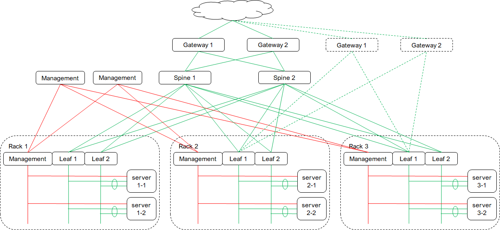
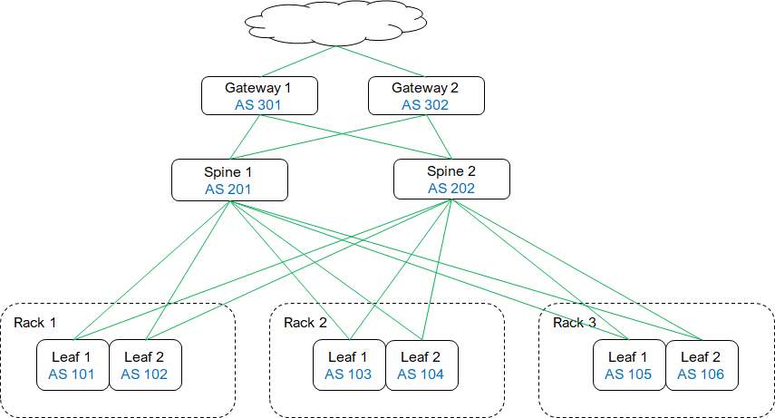
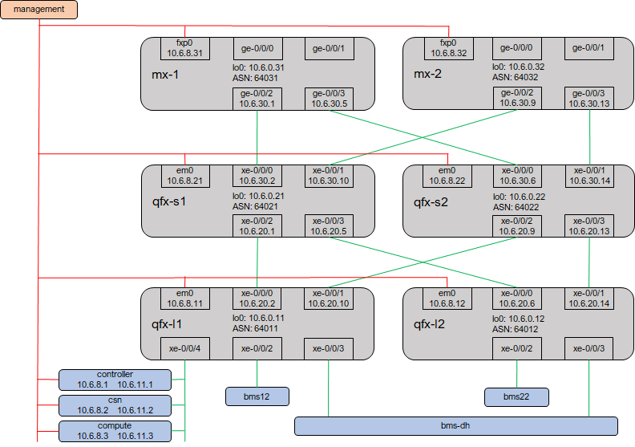
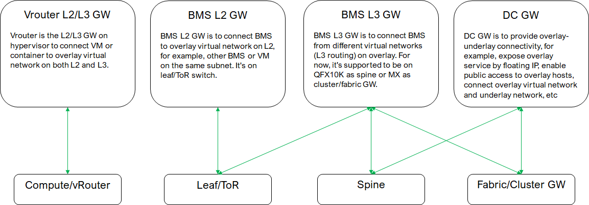

* [TOC](Contrail-Fabric-Management.md#toc)

# 1 Overview

This guide is based on Contrail 5.1 GA (5.1-38).

## 1.1 Underlay

## 1.2 Testbed

* [MX-1 underlay configuration](A1-Underlay-configuration.md#a11-mx-1)
* [MX-2 underlay configuration](A1-Underlay-configuration.md#a12-mx-2)
* [Spine-1 underlay configuration](A1-Underlay-configuration.md#a13-spine-1)
* [Spine-2 underlay configuration](A1-Underlay-configuration.md#a14-spine-2)
* [Leaf-1 underlay configuration](A1-Underlay-configuration.md#a15-leaf-1)
* [Leaf-2 underlay configuration](A1-Underlay-configuration.md#a16-leaf-2)

## 1.3 Gateway and physical role

