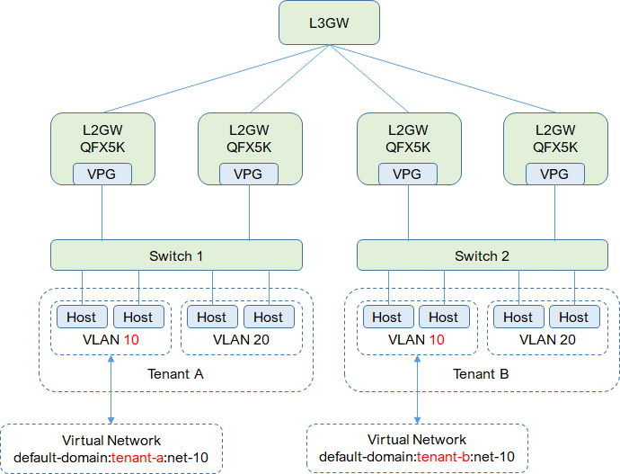
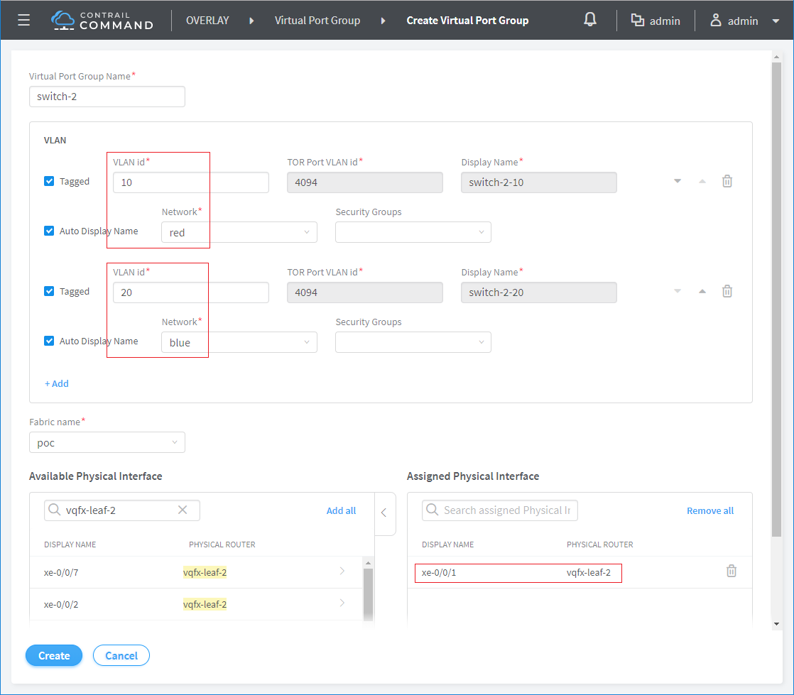
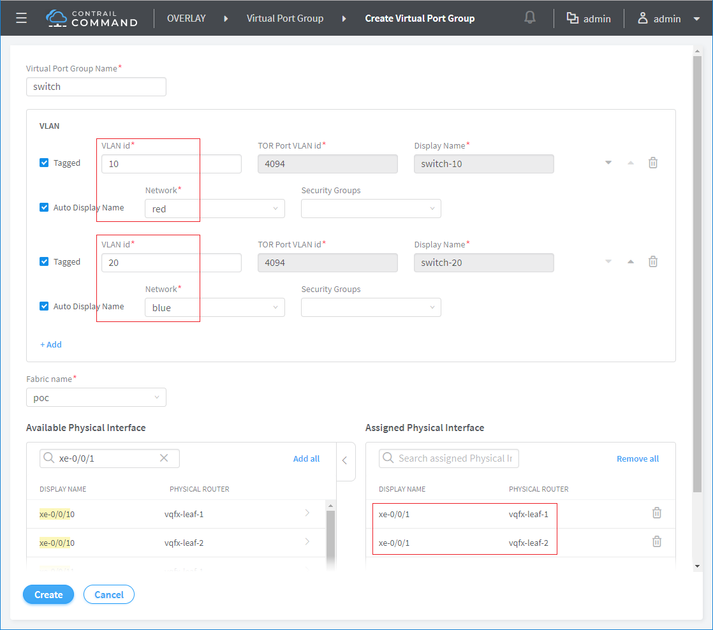

* [TOC](Contrail-Fabric-Management.md#toc)

# 10 Underlay VLAN

The existing underlay VLAN can be connected to overlay and mapped to virtual network. For the host on underlay VLAN, networking settings (IP address, gateway, DNS, etc.) are statically configured or supported by some other service on underlay.

Create virtual port group on switch-1.

Create virtual port group on switch-2.

Create virtual port group on multiple devices to provide multi-homing.

