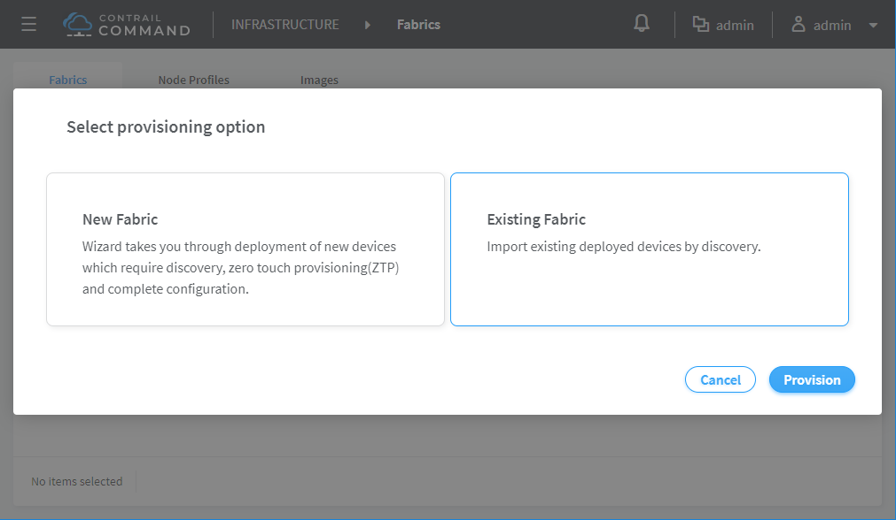
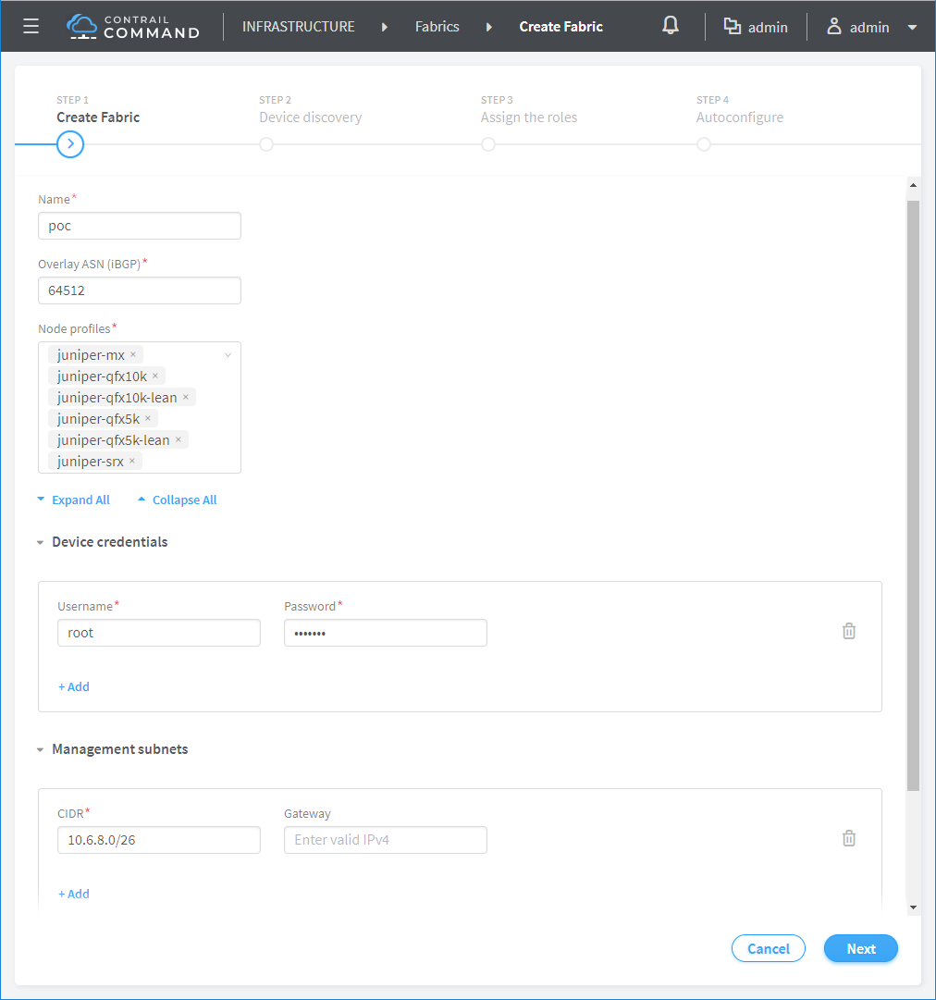
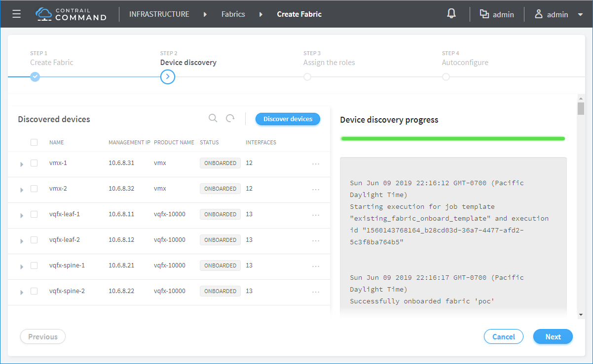
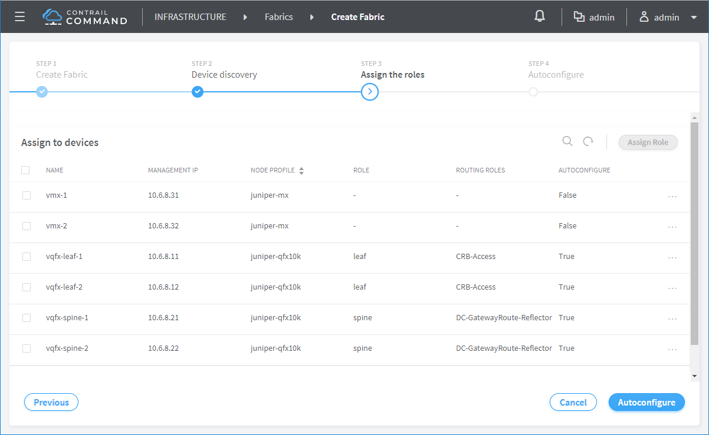
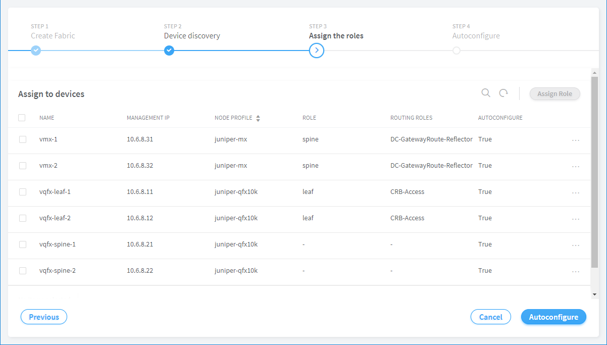
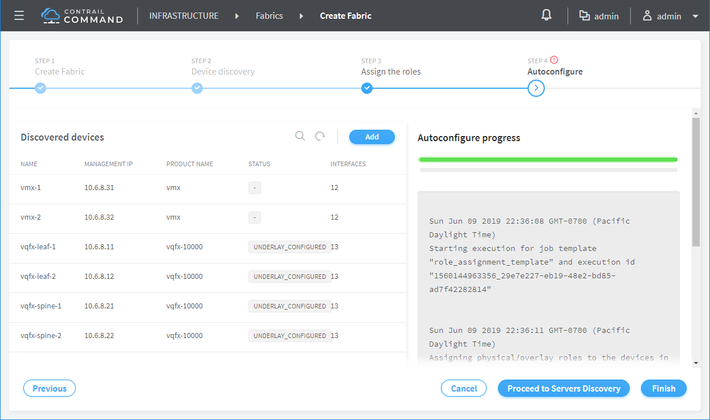
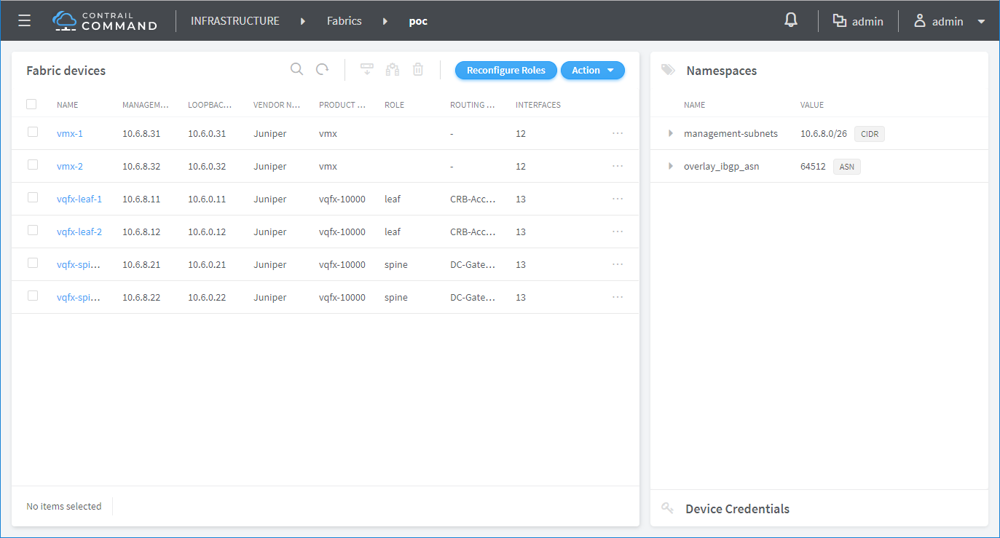
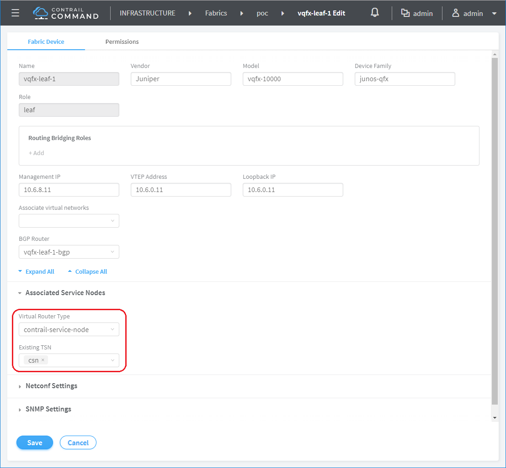

* [TOC](Contrail-Fabric-Management.md)

# 2 Import fabric

Import existing fabric where underlay is already configured.

Other than subnet, "Management subnets" can also be a list of individual devices with `/32` address.

Given the "Management subnets", devices are discovered.

Each device is assigned a node profile during discovery. User needs to assign role to each device. This is the case where GW is on spine.

This is the case where GW is on MX.

Given role assignment, configuration is pushed to each device.

The fabric is created.

Update leaf to associate with CSN.

