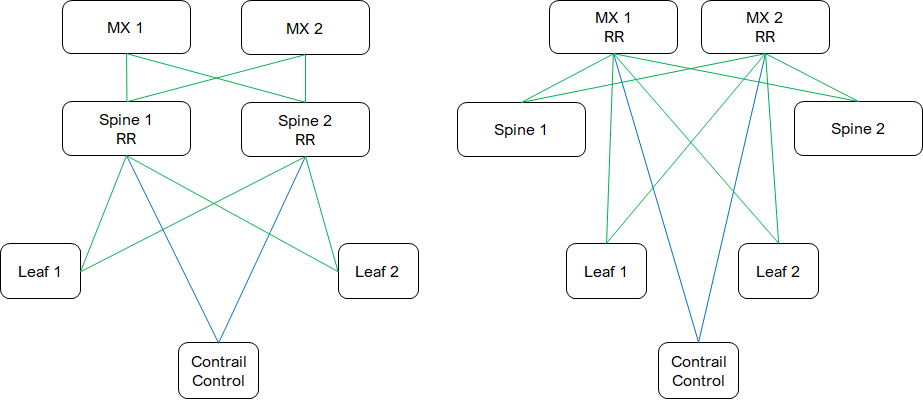

* [TOC](Contrail-Fabric-Management.md#toc)

# 3 Overlay BGP

Overlay BGP peering is established when fabric is created.

* [Spine-1 with RR overlay BGP configuration and BGP summary](A2-Overlay-BGP-configuration.md#a21-spine-1-with-rr)
* [Spine-2 with RR overlay BGP configuration and BGP summary](A2-Overlay-BGP-configuration.md#a22-spine-2-with-rr)
* [MX-1 with RR overlay BGP configuration and BGP summary](A2-Overlay-BGP-configuration.md#a23-mx-1-with-rr)
* [MX-2 with RR overlay BGP configuration and BGP summary](A2-Overlay-BGP-configuration.md#a24-mx-2-with-rr)
* [Leaf-1 overlay BGP configuration and BGP summary](A2-Overlay-BGP-configuration.md#a25-leaf-1)
* [Leaf-2 overlay BGP configuration and BGP summary](A2-Overlay-BGP-configuration.md#a26-leaf-2)

