* [TOC](Contrail-Fabric-Management.md)

# 5 BMS L2 gateway

## 5.1 Virtual network

Create a virtual network.
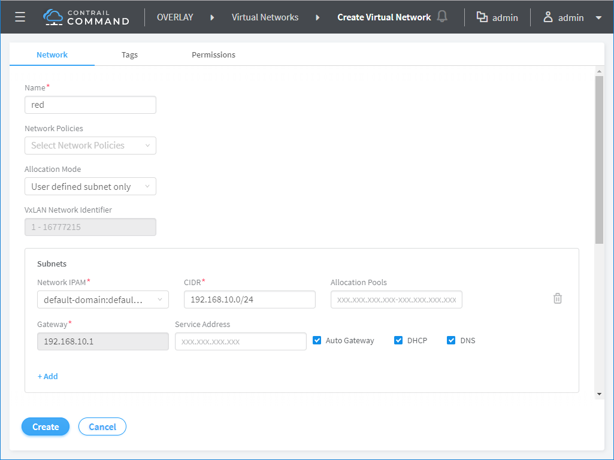

This is the workflow when a virtual network is created.
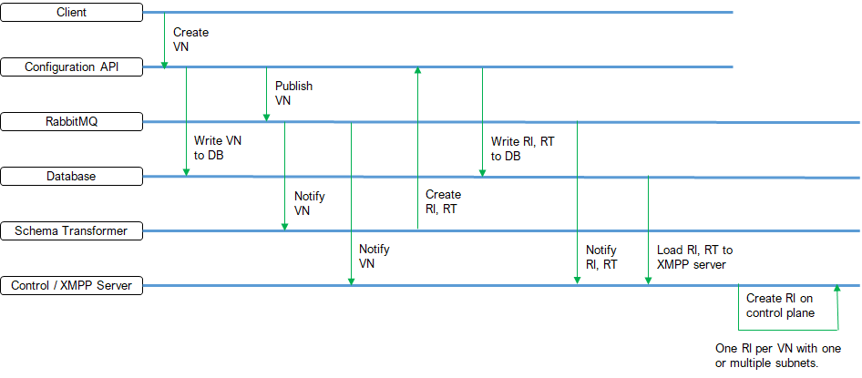


## 5.2 VM instance

Launch a VM instance on virtual network.
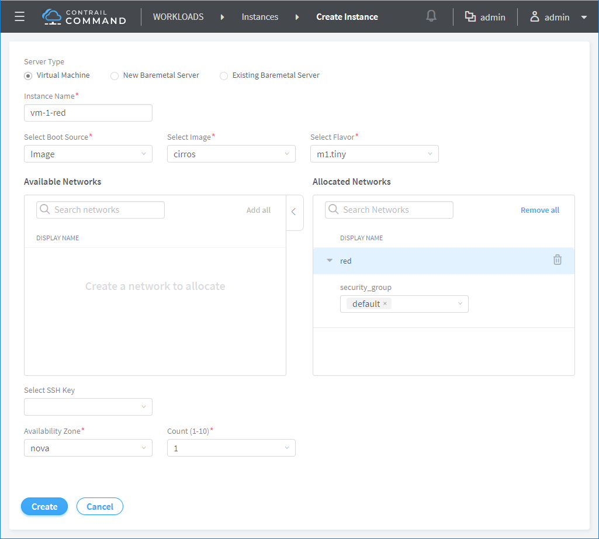

This is the workflow when a VM instance is created.
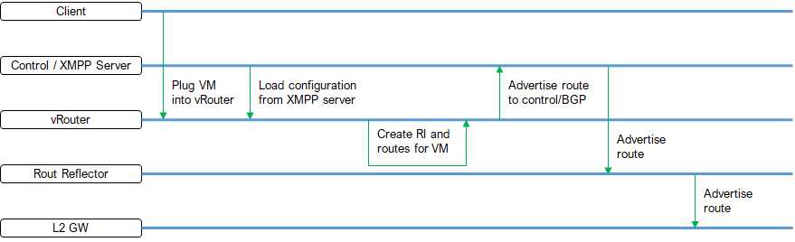

This is the virtual network L3 table on vrouter. It shows the VM route.
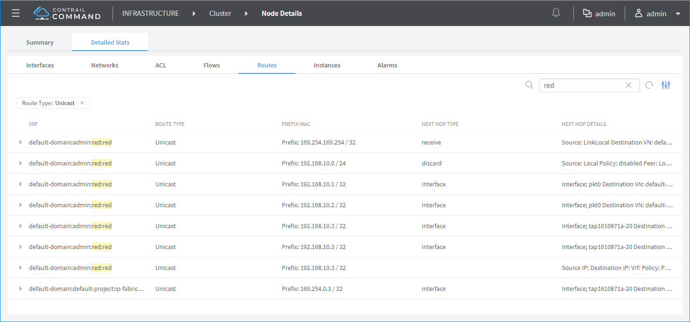

This is the virtual network L2 table on vrouter. It shows the VM L2 route.
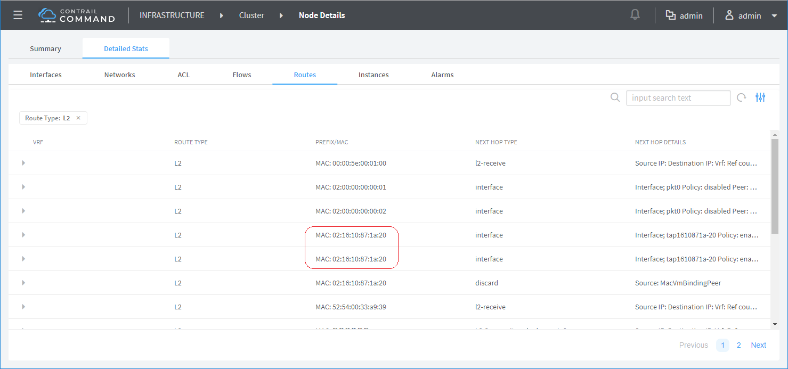

This is the route table on control node.
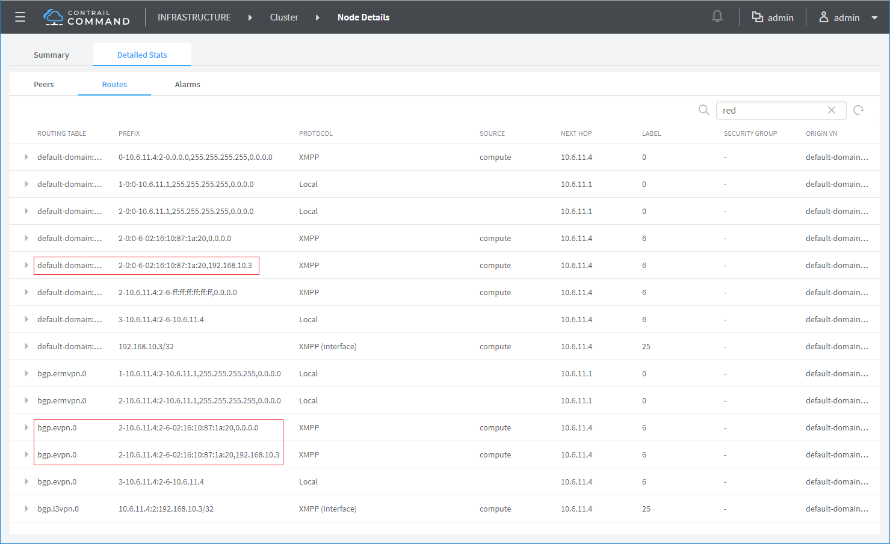


## 5.3 BMS instance

Launch a BMS instance.
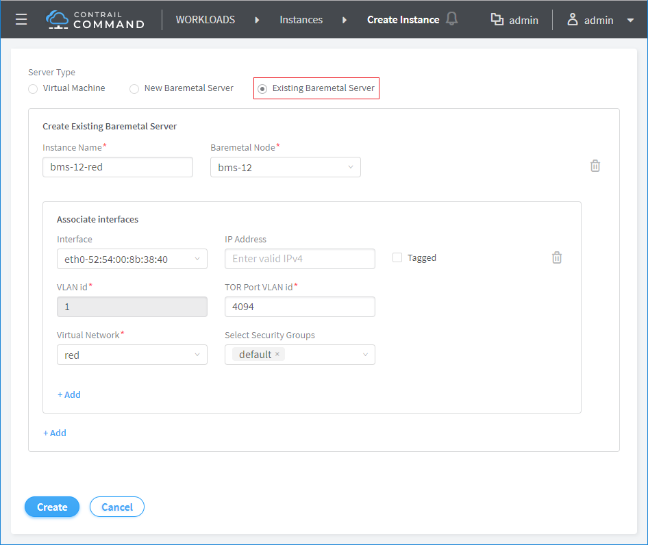

Virtual port group is created.
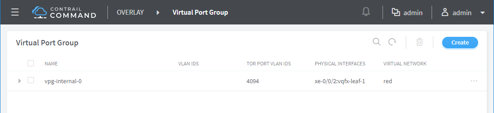

This is the workflow for BMS DHCP request.
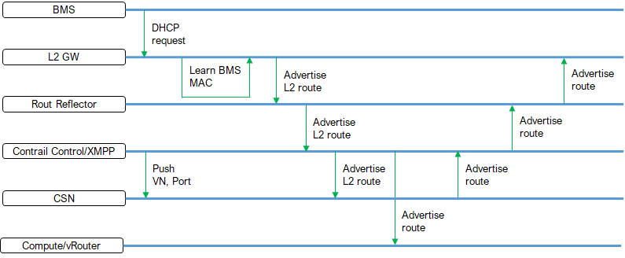

* [BMS configuration on L2GW](A3-L2-gateway-configuration.md#a31-bms-l2-on-l2gw)


## 5.4 Control plane

This is the virtual network L3 table on CSN.
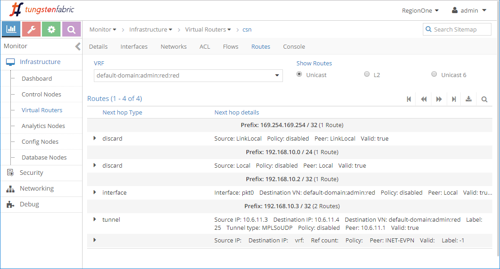

This is the virtual network L2 table on CSN. Given the association between L2 GW (leaf) and CSN, BMS L2 route is advertised.
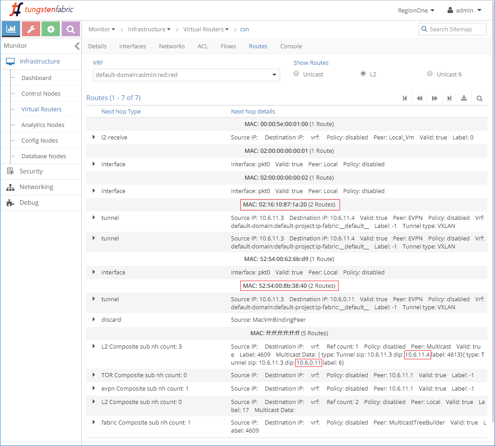

This is the virtual network L2 table on compute.
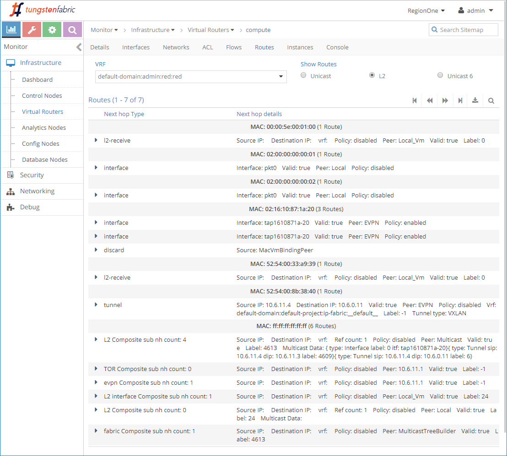

This is the virtual network EVPN table on control node.
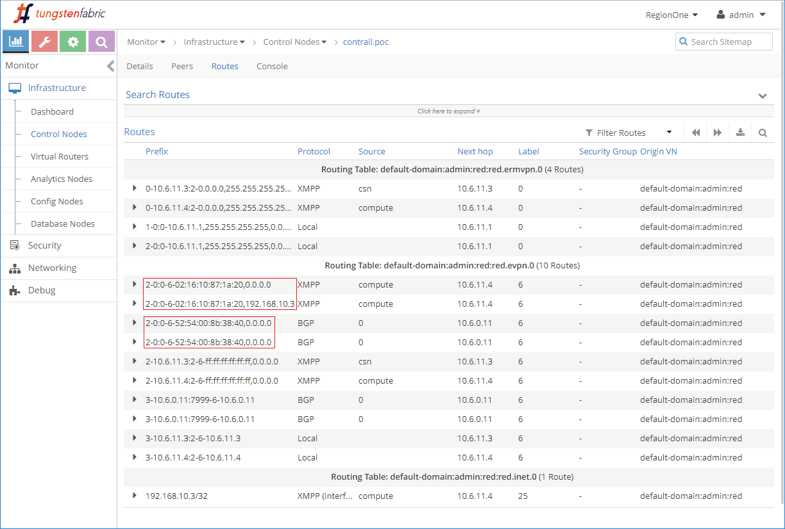

```
root@vqfx-leaf-1> show evpn database 
Instance: default-switch
VLAN  DomainId  MAC address        Active source                  Timestamp        IP address
     6          02:16:10:87:1a:20  10.6.11.4                      Jun 11 03:38:19  192.168.10.3
     6          52:54:00:8b:38:40  xe-0/0/2.0                     Jun 11 04:13:21
```
```
root@vqfx-leaf-1> show ethernet-switching table
Ethernet switching table : 5 entries, 5 learned
Routing instance : default-switch
   Vlan                MAC                 MAC      Logical                Active
   name                address             flags    interface              source
   bd-6                02:16:10:87:1a:20   D        vtep.32770             10.6.11.4
   bd-6                52:54:00:8b:38:40   D        xe-0/0/2.0
   vlan-11             52:54:00:33:a9:39   D        xe-0/0/4.0
   vlan-11             52:54:00:4c:62:71   D        xe-0/0/4.0
   vlan-11             52:54:00:62:6b:d9   D        xe-0/0/4.0
```

```
root@vqfx-leaf-1> show route advertising-protocol bgp 10.6.0.21   

bgp.rtarget.0: 12 destinations, 25 routes (12 active, 0 holddown, 0 hidden)
  Prefix                  Nexthop              MED     Lclpref    AS path
  64011:64011:268435462/96                    
*                         Self                         100        I
  64011:64512:7999999/96                    
*                         Self                         100        I
  64011:64512:8000005/96                    
*                         Self                         100        I

default-switch.evpn.0: 6 destinations, 10 routes (6 active, 0 holddown, 0 hidden)
  Prefix                  Nexthop              MED     Lclpref    AS path
  2:10.6.0.11:7999::6::52:54:00:8b:38:40/304 MAC/IP            
*                         Self                         100        I
  3:10.6.0.11:7999::6::10.6.0.11/248 IM                
*                         Self                         100        I
```
```
root@vqfx-leaf-1> show route advertising-protocol bgp 10.6.0.22    

bgp.rtarget.0: 12 destinations, 25 routes (12 active, 0 holddown, 0 hidden)
  Prefix                  Nexthop              MED     Lclpref    AS path
  64011:64011:268435462/96                    
*                         Self                         100        I
  64011:64512:7999999/96                    
*                         Self                         100        I
  64011:64512:8000005/96                    
*                         Self                         100        I

default-switch.evpn.0: 6 destinations, 10 routes (6 active, 0 holddown, 0 hidden)
  Prefix                  Nexthop              MED     Lclpref    AS path
  2:10.6.0.11:7999::6::52:54:00:8b:38:40/304 MAC/IP            
*                         Self                         100        I
  3:10.6.0.11:7999::6::10.6.0.11/248 IM                
*                         Self                         100        I
```

```
root@vqfx-leaf-1> show route receive-protocol bgp 10.6.0.21        

inet.0: 22 destinations, 37 routes (22 active, 0 holddown, 0 hidden)

:vxlan.inet.0: 13 destinations, 13 routes (13 active, 0 holddown, 0 hidden)

inet6.0: 2 destinations, 2 routes (2 active, 0 holddown, 0 hidden)

bgp.rtarget.0: 12 destinations, 25 routes (12 active, 0 holddown, 0 hidden)
  Prefix                  Nexthop              MED     Lclpref    AS path
  64011:64011:268435462/96                    
                          10.6.0.21                    100        I
  64011:64512:7999999/96                    
                          10.6.0.21                    100        I
  64011:64512:8000005/96                    
                          10.6.0.21                    100        I
  64012:64512:7999999/96                    
*                         10.6.0.21                    100        I
  64021:64512:7999999/96                    
*                         10.6.0.21                    100        I
  64512:64512:7999999/96                    
*                         10.6.0.21                    100        I
  64512:64512:8000001/96                    
*                         10.6.0.21                    100        I
  64512:64512:8000005/96                    
*                         10.6.0.21                    100        I
  64512:10.6.11.1:0/96                    
*                         10.6.0.21                    100        I
  64512:10.6.11.1:5/96                    
*                         10.6.0.21                    100        I
  64512:10.6.11.1:7/96                    
*                         10.6.0.21                    100        I

bgp.evpn.0: 4 destinations, 8 routes (4 active, 0 holddown, 0 hidden)
  Prefix                  Nexthop              MED     Lclpref    AS path
  2:10.6.11.4:2::6::02:16:10:87:1a:20/304 MAC/IP            
*                         10.6.11.4            100     200        ?
  2:10.6.11.4:2::6::02:16:10:87:1a:20::192.168.10.3/304 MAC/IP            
*                         10.6.11.4            100     200        ?
  3:10.6.11.3:2::6::10.6.11.3/248 IM                
*                         10.6.11.3            200     100        ?
  3:10.6.11.4:2::6::10.6.11.4/248 IM                
*                         10.6.11.4            200     100        ?

default-switch.evpn.0: 6 destinations, 10 routes (6 active, 0 holddown, 0 hidden)
  Prefix                  Nexthop              MED     Lclpref    AS path
  2:10.6.11.4:2::6::02:16:10:87:1a:20/304 MAC/IP            
*                         10.6.11.4            100     200        ?
  2:10.6.11.4:2::6::02:16:10:87:1a:20::192.168.10.3/304 MAC/IP            
*                         10.6.11.4            100     200        ?
  3:10.6.11.3:2::6::10.6.11.3/248 IM                
*                         10.6.11.3            200     100        ?
  3:10.6.11.4:2::6::10.6.11.4/248 IM                
*                         10.6.11.4            200     100        ?
```
```
root@vqfx-leaf-1> show route receive-protocol bgp 10.6.0.22    

inet.0: 22 destinations, 37 routes (22 active, 0 holddown, 0 hidden)

:vxlan.inet.0: 13 destinations, 13 routes (13 active, 0 holddown, 0 hidden)

inet6.0: 2 destinations, 2 routes (2 active, 0 holddown, 0 hidden)

bgp.rtarget.0: 12 destinations, 25 routes (12 active, 0 holddown, 0 hidden)
  Prefix                  Nexthop              MED     Lclpref    AS path
  64011:64011:268435462/96                    
                          10.6.0.22                    100        I
  64011:64512:7999999/96                    
                          10.6.0.22                    100        I
  64011:64512:8000005/96                    
                          10.6.0.22                    100        I
  64012:64512:7999999/96                    
                          10.6.0.22                    100        I
  64022:64512:7999999/96                    
*                         10.6.0.22                    100        I
  64512:64512:7999999/96                    
                          10.6.0.22                    100        I
  64512:64512:8000001/96                    
                          10.6.0.22                    100        I
  64512:64512:8000005/96                    
                          10.6.0.22                    100        I
  64512:10.6.11.1:0/96                    
                          10.6.0.22                    100        I
  64512:10.6.11.1:5/96                    
                          10.6.0.22                    100        I
  64512:10.6.11.1:7/96                    
                          10.6.0.22                    100        I

bgp.evpn.0: 4 destinations, 8 routes (4 active, 0 holddown, 0 hidden)
  Prefix                  Nexthop              MED     Lclpref    AS path
  2:10.6.11.4:2::6::02:16:10:87:1a:20/304 MAC/IP            
                          10.6.11.4            100     200        ?
  2:10.6.11.4:2::6::02:16:10:87:1a:20::192.168.10.3/304 MAC/IP            
                          10.6.11.4            100     200        ?
  3:10.6.11.3:2::6::10.6.11.3/248 IM                
                          10.6.11.3            200     100        ?
  3:10.6.11.4:2::6::10.6.11.4/248 IM                
                          10.6.11.4            200     100        ?

default-switch.evpn.0: 6 destinations, 10 routes (6 active, 0 holddown, 0 hidden)
  Prefix                  Nexthop              MED     Lclpref    AS path
  2:10.6.11.4:2::6::02:16:10:87:1a:20/304 MAC/IP            
                          10.6.11.4            100     200        ?
  2:10.6.11.4:2::6::02:16:10:87:1a:20::192.168.10.3/304 MAC/IP            
                          10.6.11.4            100     200        ?
  3:10.6.11.3:2::6::10.6.11.3/248 IM                
                          10.6.11.3            200     100        ?
  3:10.6.11.4:2::6::10.6.11.4/248 IM                
                          10.6.11.4            200     100        ?
```

```
root@vqfx-leaf-1> show route table default-switch.evpn.0 

default-switch.evpn.0: 6 destinations, 10 routes (6 active, 0 holddown, 0 hidden)
+ = Active Route, - = Last Active, * = Both

2:10.6.0.11:7999::6::52:54:00:8b:38:40/304 MAC/IP        
                   *[EVPN/170] 00:19:19
                      Indirect
2:10.6.11.4:2::6::02:16:10:87:1a:20/304 MAC/IP        
                   *[BGP/170] 00:54:23, MED 100, localpref 200, from 10.6.0.21
                      AS path: ?, validation-state: unverified
                    > to 10.6.11.4 via irb.11
                    [BGP/170] 00:54:23, MED 100, localpref 200, from 10.6.0.22
                      AS path: ?, validation-state: unverified
                    > to 10.6.11.4 via irb.11
2:10.6.11.4:2::6::02:16:10:87:1a:20::192.168.10.3/304 MAC/IP        
                   *[BGP/170] 00:54:23, MED 100, localpref 200, from 10.6.0.21
                      AS path: ?, validation-state: unverified
                    > to 10.6.11.4 via irb.11
                    [BGP/170] 00:54:23, MED 100, localpref 200, from 10.6.0.22
                      AS path: ?, validation-state: unverified
                    > to 10.6.11.4 via irb.11
3:10.6.0.11:7999::6::10.6.0.11/248 IM            
                   *[EVPN/170] 00:54:22
                      Indirect
3:10.6.11.3:2::6::10.6.11.3/248 IM            
                   *[BGP/170] 00:54:23, MED 200, localpref 100, from 10.6.0.21
                      AS path: ?, validation-state: unverified
                    > to 10.6.11.3 via irb.11
                    [BGP/170] 00:54:23, MED 200, localpref 100, from 10.6.0.22
                      AS path: ?, validation-state: unverified
                    > to 10.6.11.3 via irb.11
3:10.6.11.4:2::6::10.6.11.4/248 IM            
                   *[BGP/170] 00:54:23, MED 200, localpref 100, from 10.6.0.21
                      AS path: ?, validation-state: unverified
                    > to 10.6.11.4 via irb.11
                    [BGP/170] 00:54:23, MED 200, localpref 100, from 10.6.0.22
                      AS path: ?, validation-state: unverified
                    > to 10.6.11.4 via irb.11
```


## 5.5 Connectivity

Default security group needs to be updated to allow the connectivity between VM and BMS. Change ingress type to `CIDR` and allow all addresses.
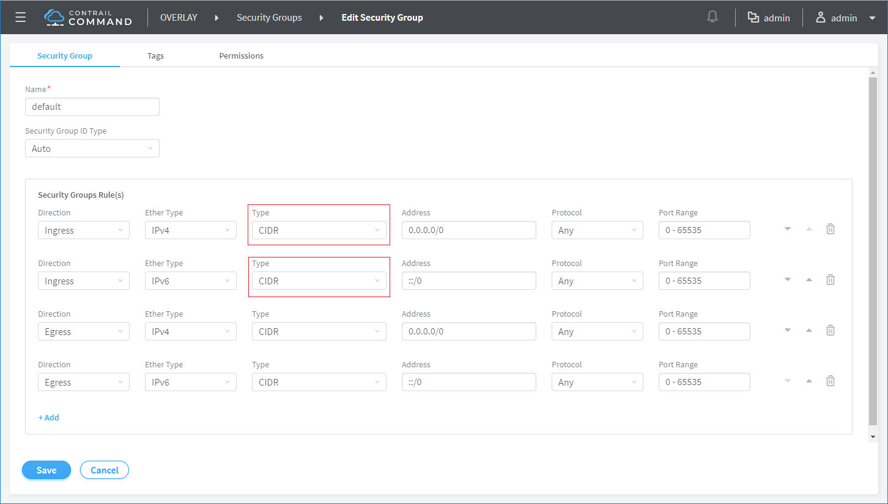

This is the workflow when BMS connects to VM.
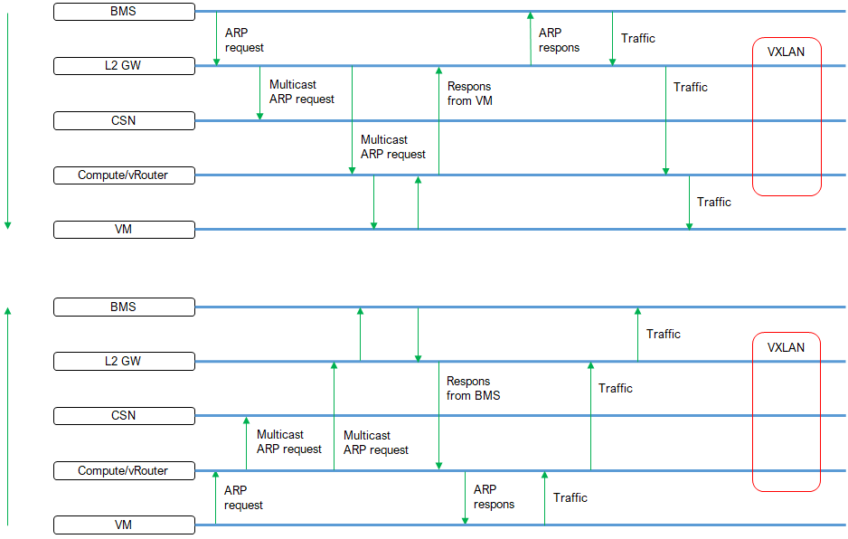

