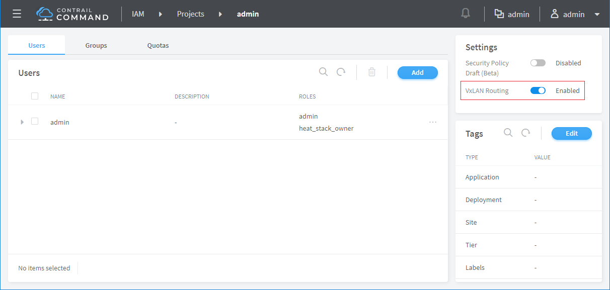

* [TOC](Contrail-Fabric-Management.md)

# 7 BMS L3 gateway

Create two virtual networks.

Launch a BMS instance on each virtual network.

VXLAN routing has to be enabled for the tenant/project.

## 7.1 L3 gateway on spine

L3 gateway is assigned on spine during importing fabric.

Create logical router and connect virtual networks onto it.

* [Logical router configuration on spine-1](A4-L3-gateway-configuration.md#a41-l3-gateway-on-spine-1)
* [Logical router configuration on spine-2](A4-L3-gateway-configuration.md#a42-l3-gateway-on-spine-2)

This is the workflow of L3 routing

## 7.2 L3 Gateway on MX

L3 gateway is assigned on MX during importing fabric.

Extend virtual networks to MX.

* [Virtual network configuration on MX-1](A4-L3-gateway-configuration.md#a43-virtual-network-on-mx-1)
* [Virtual network configuration on MX-2](A4-L3-gateway-configuration.md#a44-virtual-network-on-mx-2)

Create a network policy to connect virtual networks.

Attach the network policy to virtual networks.

* [Network policy configuration on MX-1](A4-L3-gateway-configuration.md#a45-network-policy-on-mx-1)
* [Network policy configuration on MX-2](A4-L3-gateway-configuration.md#a46-network-policy-on-mx-2)

Note, BMS can ping IRB address on L3GW. The gateway address on L3GW doesn't respond ICMP request because it's a virtual address.

## 7.3 L3 Gateway on leaf

