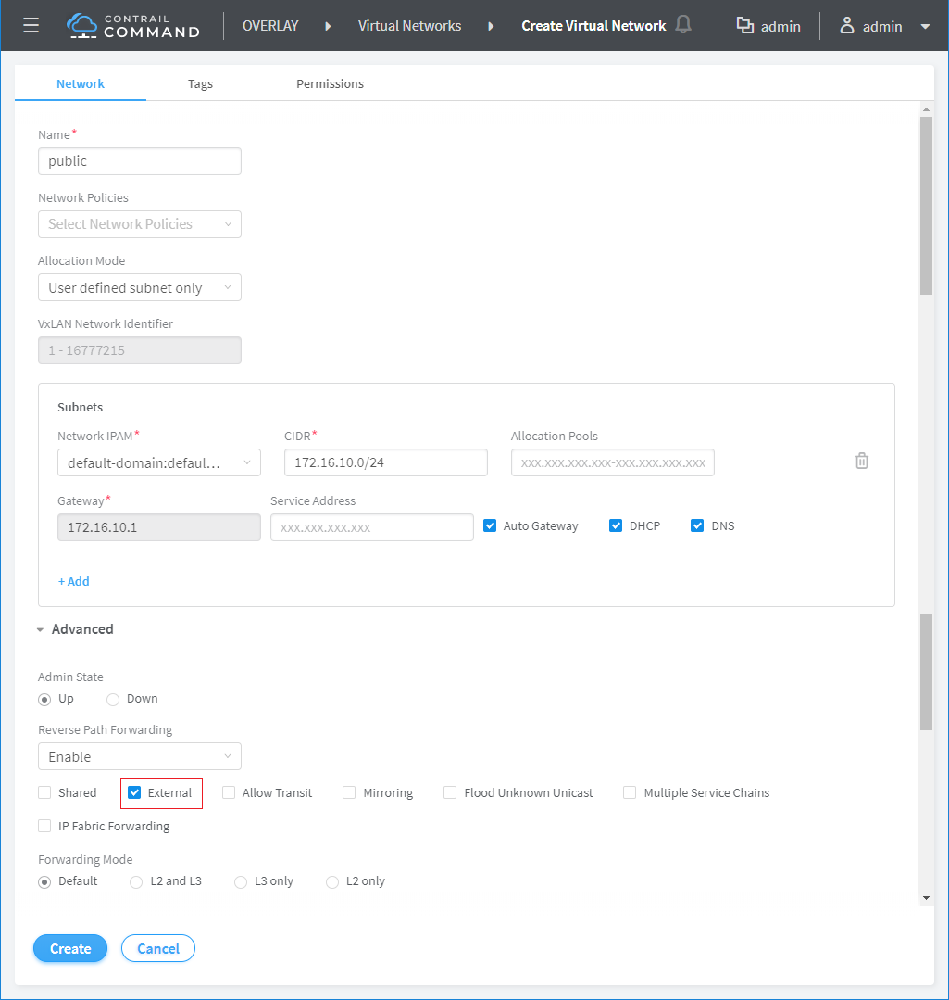
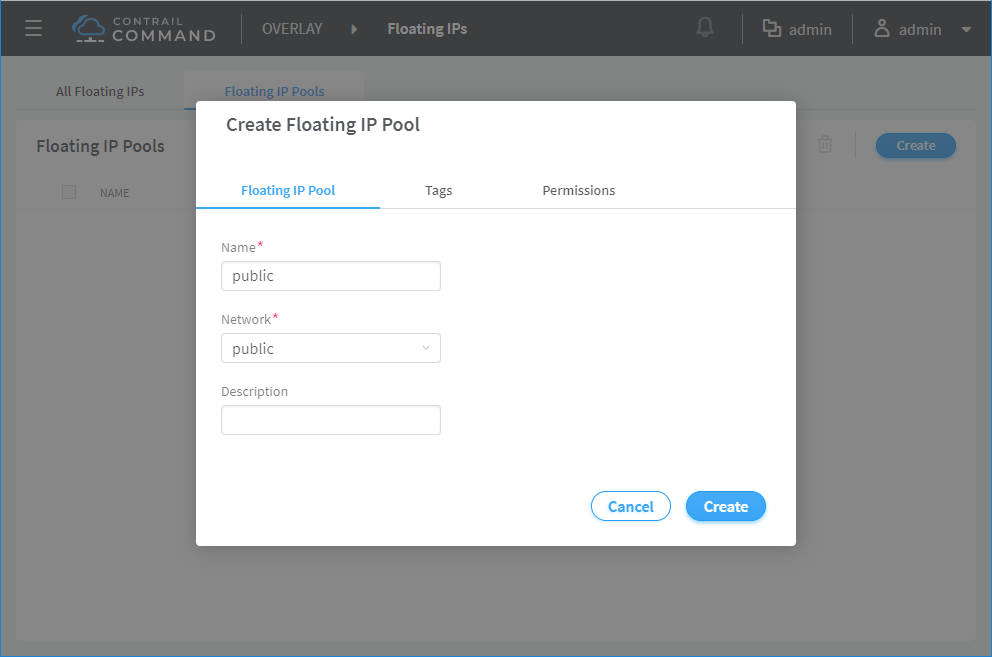
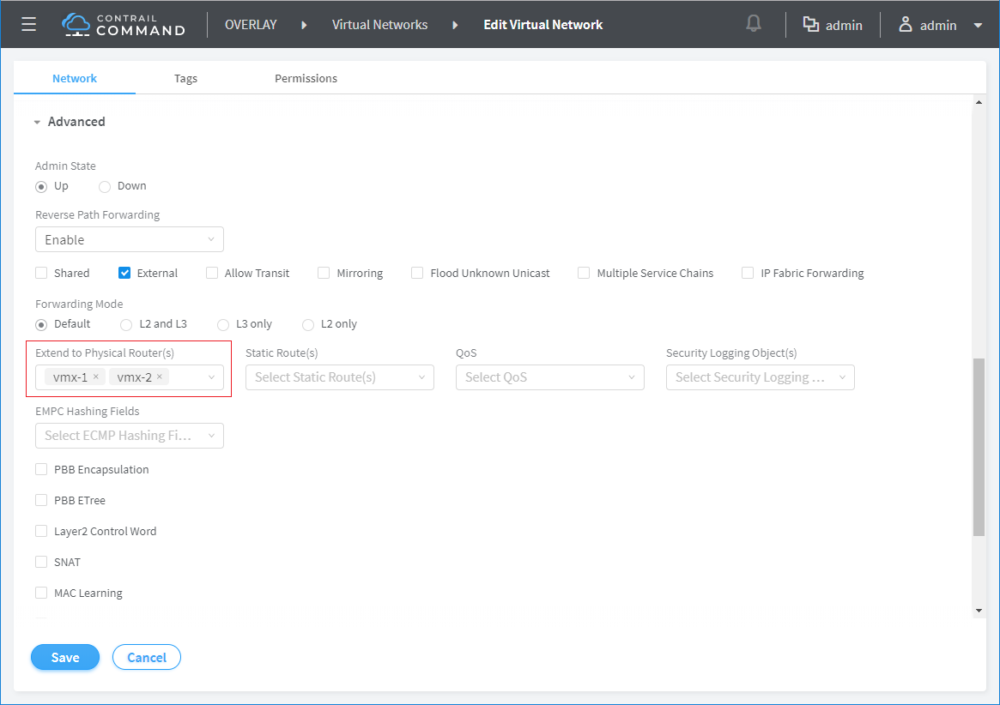
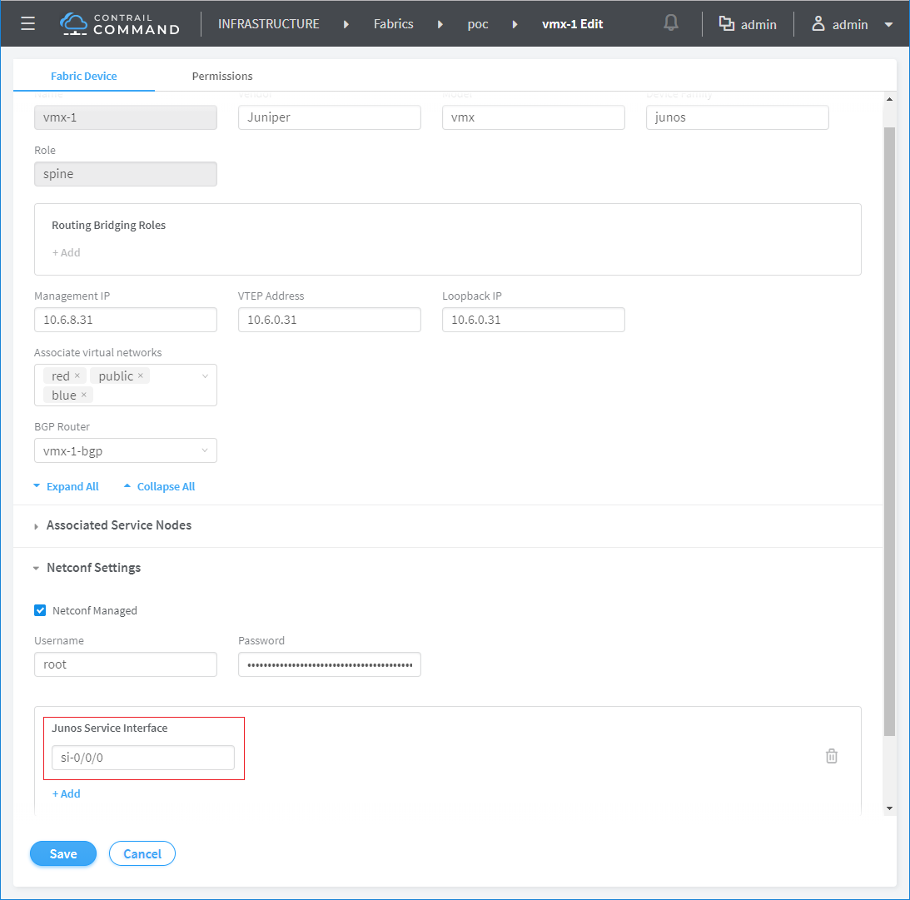
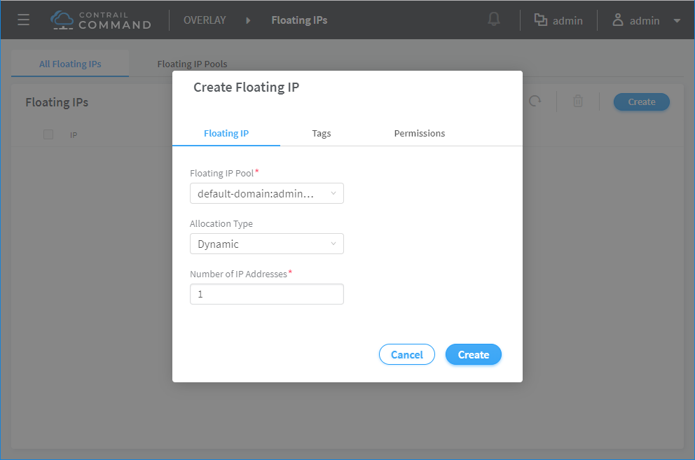
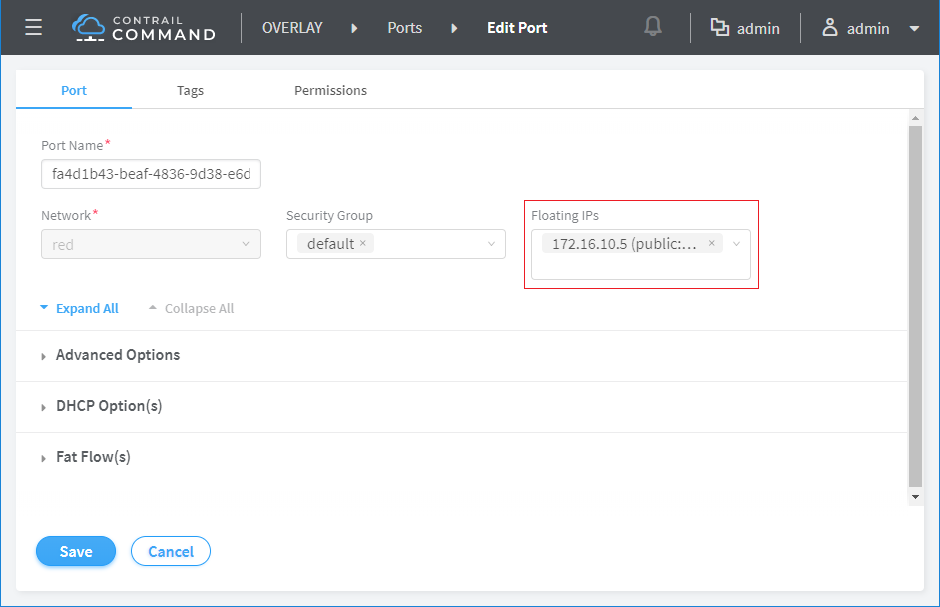

* [TOC](Contrail-Fabric-Management.md)

# 8 Overlay-Underlay

The overlay-underlay connectivity is implemented by DC-GW role.

Create public network. It's a virtual network who has underlay routable address space. It's extended to underlay by DC-GW.





## 8.1 DC-GW on MX

Extend virtual network to MX.


* [public network configuration on MX-1](A5-Overlay-underlay-configuration.md#a51-public-network-on-mx-1)
* [public network configuration on MX-2](A5-Overlay-underlay-configuration.md#a52-public-network-on-mx-2)


### 8.1.1 Directly underlay access

Public address is allocated to workload when it's launched on public virtual network. That gives workload directly underlay access.


### 8.1.2 Floating IP

Launch workload on private virtual network with private address. Allocate a FIP from FIP pool on public virtual network and assign the FIP to workload. That gives workload public access by NAT. For VM or container, NAT is done by vrouter. For BMS, NAT is done by DC-GW.

Service interface has to be configured on MX manually. Depends on the hardware, either in-line service or service PIC is supported.
```
set chassis fpc 0 pic 0 inline-services bandwidth 10g
set chassis network-services enhanced-ip
```
Service interface `se-<fpc>/<pic>/0` shows up after commit.








### 8.1.3 SNAT

SNAT allows workload to access public without public address.

SNAT is not supported for BMS.

For VM or container, there are legacy SNAT and distributed SNAT.
* The legacy SNAT is done centralized by one router (may have another backup) who creates a namespace and iptable rules to apply SNAT. Tunnel is between vrouter and DC-GW who is required to provide overlay-underlay connectivity.

* The distributed SNAT is done by the vrouter who carries workload. The vrouter forward traffic directly to underlay without tunnel. DC-GW may be required to connect private underlay and public underlay.


## 8.2 DC-GW on spine

### 8.2.1 Directly underlay access

This is the only option to provide overlay-underlay connectivity for BMS.


### 8.2.2 Floating IP

This is not supported for BMS because QFX doesn't support NAT.


### 8.2.3 SNAT

This is not supported for BMS because QFX doesn't support NAT.


