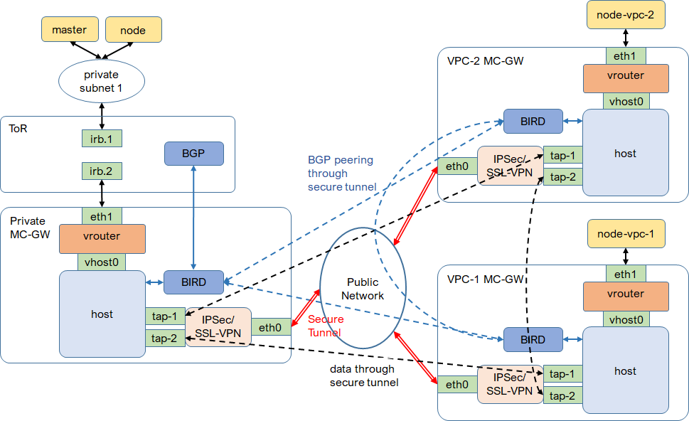
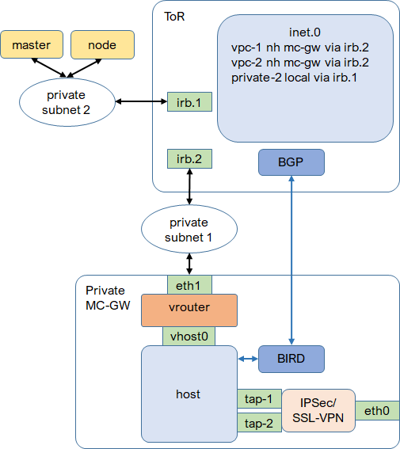
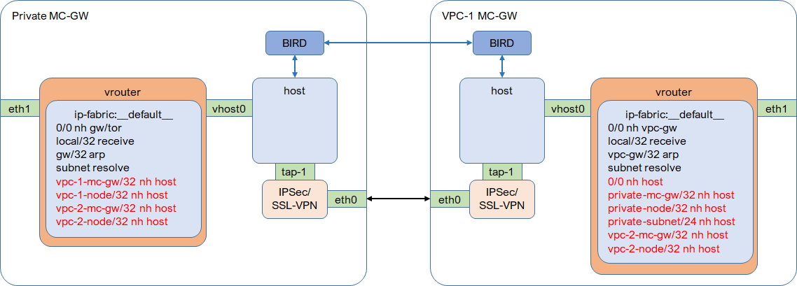
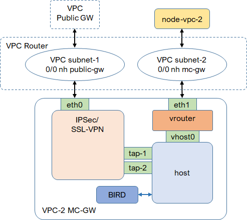
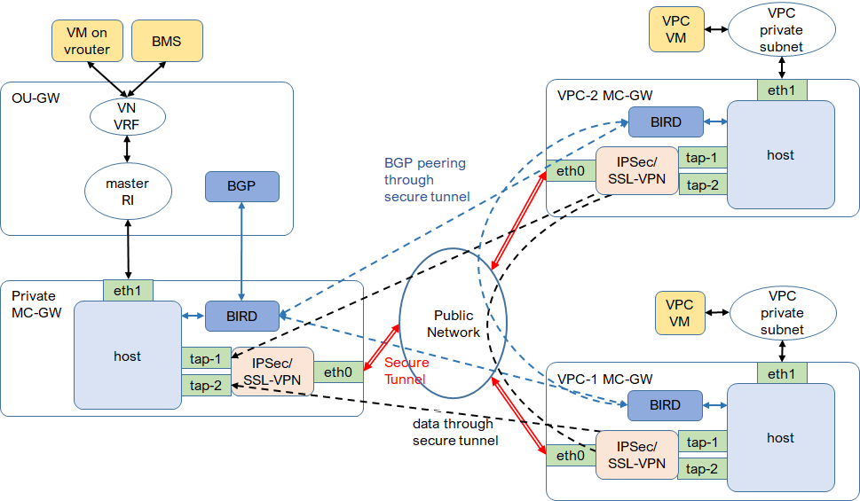

* [TOC](Multi-Cloud.md#toc)

# 2 Architecture

## 2.1 Connect container

MC-GW is the gateway to connect private subnets and public VPCs. MC-GWs provide underlay connectivity with secured tunnel. Overlay tunnel between the vrouter on on-prem node and the vrouter on public cloud node is established on underlay.

### 2.1.1 ToR

A gateway is required to route traffic between MC-GW and private subnets. The ToR of MC-GW is typically used as this gateway.

The ToR is configured when creating private cloud and updated when public VPC is added. BGP between BIRD on MC-GW and ToR is to exchange routes of private subnets and public VPCs.

#### [ToR configuration](A1-ToR.md#a11-tor-configuration)
#### [ToR route table](A1-ToR.md#a12-tor-route-table)

### 2.1.2 MC-GW

#### 2.1.2.1 Vrouter

For underlay packet (no encapsulation), when it arrives, vrouter looks up routing instance `__default__` in virtual network `ip-fabric`. For local traffic, it will match the recieve route of vrouter and is sent to `vhost0`. For transit traffic, if no match, packet will follow the default route and is sent to vrouter gateway. To allow private clusters to reach public VPCs, an interface route table is created with all public VPC hosts /32 route and is attached to interface `vhost0`. Then those /32 routes are imported into routing instance `__default__`. Now, traffic to public VPCs will be sent to `vhost0` and handled by host routing table. The interface route table is created and updated when adding VPC.

For overlay packet, when it arrives, vrouter decapsulates it and tries to resolve it by looking for MPLS label or VNI depending on encapsulation. If resolution is failed, vrouter sends overlay packet back to routing instance `__default__`, where the packet will match the route to public VPCs and is sent to `vhost0`.

#### 2.1.2.2 BIRD

BIRD is the routing component on each MC-GW. On private MC-GW, BIRD peers with the ToR and all other public MC-GWs. On each public MC-GW, BIRD peers with private MC-GW and all other public MC-GWs.

#### [BIRD protocols on private MC-GW](A2-BIRD.md#a21-protocols-on-private-mc-gw)
#### [BIRD routes on private MC-GW](A2-BIRD.md#a22-routes-on-private-mc-gw)
#### [BIRD protocols on public MC-GW](A2-BIRD.md#a23-protocols-on-public-mc-gw)
#### [BIRD routes on public MC-GW](A2-BIRD.md#a24-routes-on-public-mc-gw)
#### [BIRD configuration on private MC-GW](A2-BIRD.md#a25-configuration-on-private-mc-gw)
#### [BIRD configuration on public MC-GW](A2-BIRD.md#a26-configuration-on-public-mc-gw)

#### 2.1.2.3 Host

#### [Host route on private MC-GW](A3-Host.md#a31-host-route-on-private-mc-gw)
#### [Host route on public MC-GW](A3-Host.md#a32-host-route-on-public-mc-gw)

### 2.1.3 VPC router

To make MC-GW the gateway for public VPC nodes, the default route in VPC subnet for nodes points to MC-GW. Both public/internet access and private cluster access from VPC nodes are going through MC-GW and secured. A default route is added into vrouter on MC-GW as well for this purpose.

## 2.2 Connect VM and BMS

MC-GWs provide underlay secured connectivity. VM on public cloud is considered on underlay. To connect on-prem VM and BMS on overlay, an overlay-underlay gateway is required to terminate overlay tunnel and connect VM and BMS to underlay.

### 2.2.1 Overlay-underlay gateway

The gateway terminates overlay tunnel and connects virtual network VRF to master routing instance. The gateway also peer with BIRD on MC-GW to populate virtual network.

### 2.2.2 MC-GW

Vrouter is not required. Traffic will routed by the host, secured by security service. Route population is handled by BIRD.

