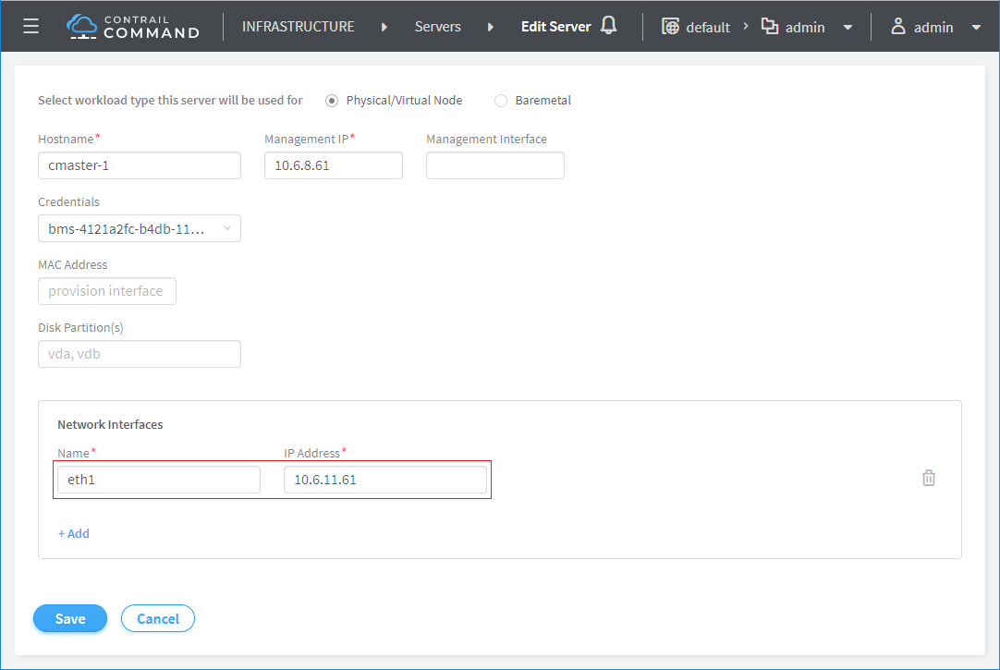
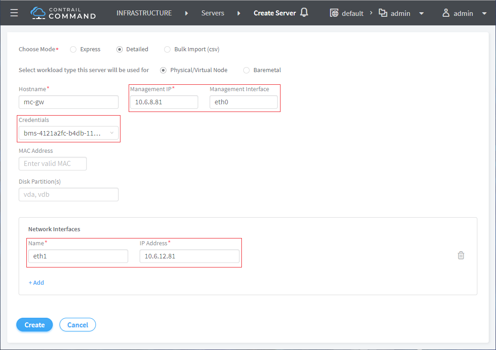
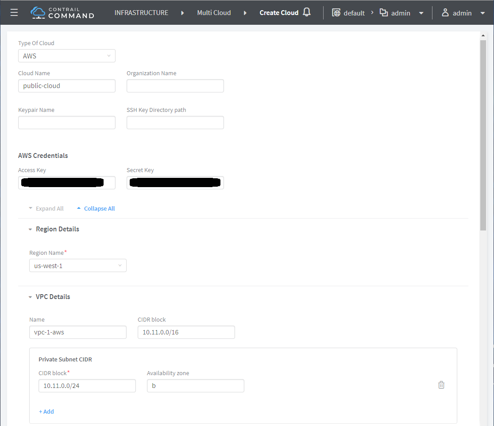
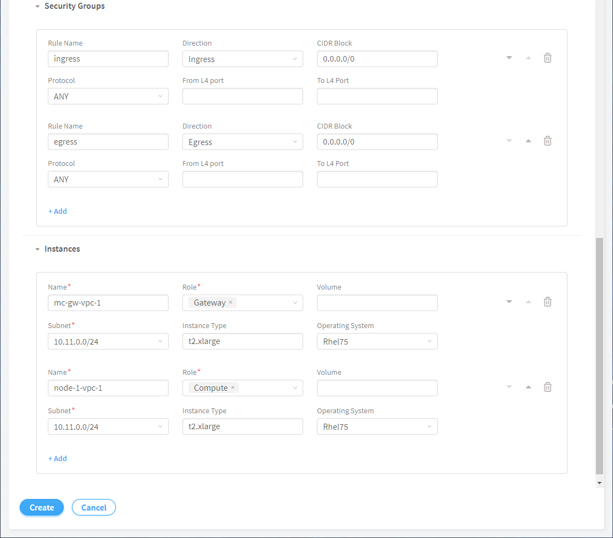
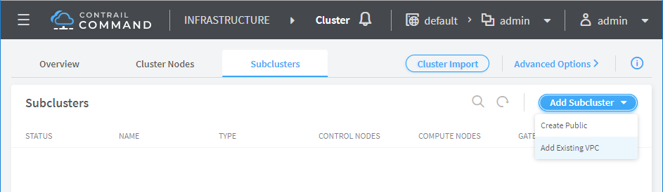
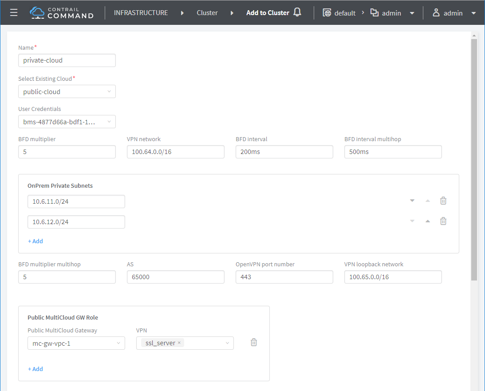
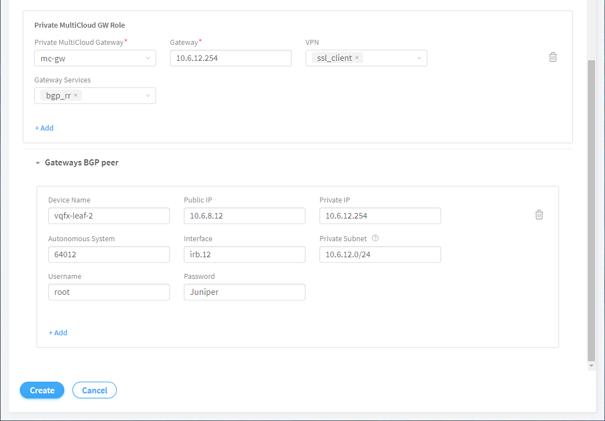
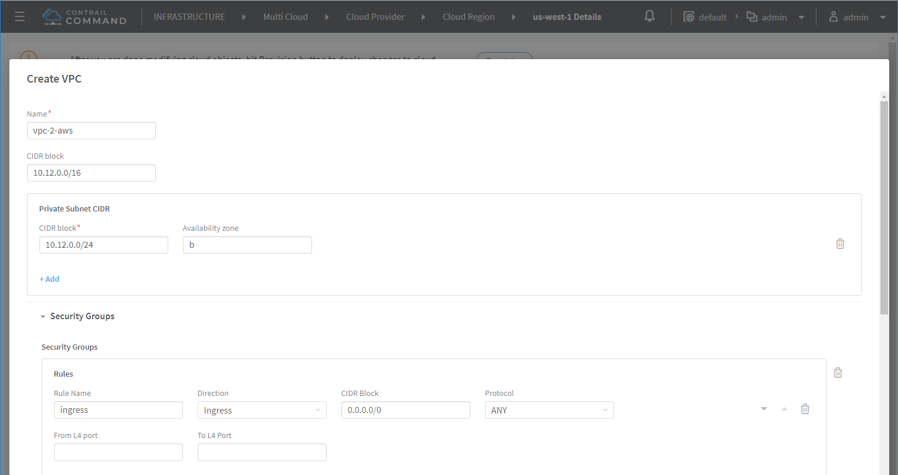
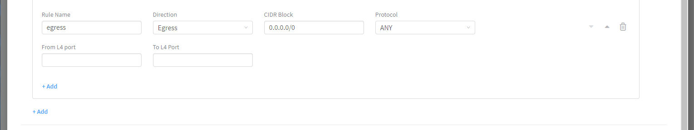
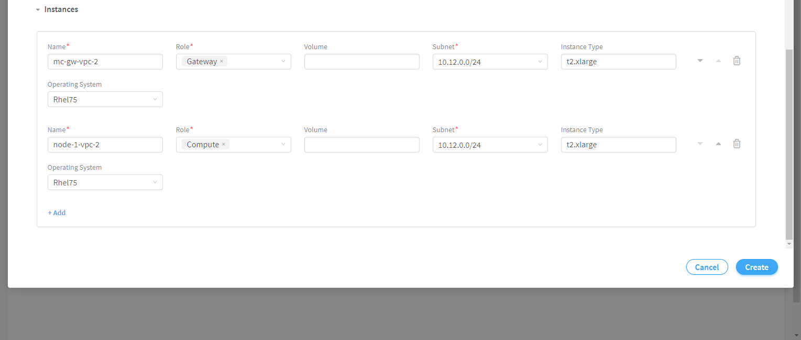

* [TOC](Multi-Cloud.md#toc)

# 3 Deployment

## 3.1 Deploy on Contrail-Kubernetes cluster

This deployment is based on [contrail-poc](https://github.com/tonyliu0592/contrail-poc) cluster `kubernetes-mc`. The deployment is done on Contrail Command.


### 3.1.1 Update server

#### Configure server data interface


#### Note
Update data interface for all the following servers.
```
cmaster-1    eth1    10.6.11.61
csn-1        eth1    10.6.11.3
node-1       eth1    10.6.11.67
node-2       eth1    10.6.11.68
```


#### Create MC-GW server




### 3.1.2 Create public cloud

Public cloud is organized as this hierarchy.
```
- public cloud
  - provider
    - region
      - VPC
        - host
```


#### Create public cloud
This is to create the public cloud with initial hierarchy. After that, the public cloud can be updated on each layer.




Login Command VM and monitor the log.
```
ssh command
tail -f /var/log/contrail/cloud.log
```

This message indicates a successful creation.
```
msg="Terraform created all resources successfully"
```
AWS portal also shows all resources are create.


### 3.1.3 Create private cloud

Private cloud here is basically the MC-GW on premises.

#### Add sub-cluster
This is to create private cloud and connect to initial VPC. More VPCs can be added later by updating public cloud.





After click button "Create", Contrail Command will logout. To check the progress, login Command VM and monitor the log.
```
ssh command
tail -f /var/log/contrail/deploy.log
```

Once the process is finished, login Contrail Command. There will be `public-cloud` created.


### 3.1.4 Update public cloud

Click `public-cloud`, goto specific layer, update it and all below.
```
- public cloud
  - provider
    - region
      - VPC
        - host
```

#### Add VPC





After creating the VPC, click button `provision` to apply the update. Resources on public cloud will be created as requested. Private cloud (MC-GW) will also be updated to add a new secured tunnel to the VPC.


## 3.2 Deploy MC-GW only

This is to deploy on-prem MC-GW and cloud MC-GW only. It can connect any workloads between local subnets and cloud VPCs. Some routing has to be done manually. The deployment is done with CLI.


### 3.2.1 Launch Contrail Command
Contrail Command container has all required utilities and playbooks. It doesn't matter if the Command has any clusters imported/created or no cluster. Since the deployment is done by CLI, not Command, the deployment is not visible on Contrail Command.


### 3.2.2 SSH key

#### Create SSH key pair.
```
ssh-keygen
```

#### Create SSH configuration `~/.ssh/config`.
```
Host *
    StrictHostKeyChecking no
    UserKnownHostsFile /dev/null
```

#### Copy SSH key into Command container.
```
docker exec contrail_command mkdir -p /root/.ssh
docker cp .ssh/id_rsa contrail_command:/root/.ssh/
docker cp .ssh/id_rsa.pub contrail_command:/root/.ssh/
docker cp .ssh/config contrail_command:/root/.ssh/
```


### 3.2.3 Parameters

#### Build `topology.yaml`.
```
- provider: onprem
  organization:
  project:
  instances:
    - name: mc-gw
      public_ip: 10.6.8.81
      private_ip: 10.6.12.81
      interface: eth1
      provision: true
      username: root
      password: c0ntrail123
      roles:
        - gateway
      private_subnet:
        - 10.6.12.0/24
        - 10.6.11.0/24
      protocols_mode:
        - ssl_client
      gateway: 10.6.12.254

- provider: aws
  organization:
  project:
  prebuild: r1912
  regions:
    - name: us-west-1
      vpc:
        - name: vpc-1-aws
          cidr_block: 10.11.0.0/16
          subnets:
            - name: mc-gw
              cidr_block: 10.11.0.0/23
              availability_zone: b
          security_groups:
              - name: egress
                egress:
                  from_port: 0
                  to_port: 0
                  protocol: -1
                  cidr_blocks:
                  - 0.0.0.0/0
              - name: ingress
                ingress:
                  from_port: 0
                  to_port: 0
                  protocol: -1
                  cidr_blocks:
                  - 0.0.0.0/0
          instances:
            - name: mc-gw-vpc-1
              roles:
                - gateway
              provision: true
              username: ec2-user
              os: rhel7
              instance_type: t2.xlarge
              subnets: mc-gw
              availability_zone: b
              protocols_mode:
                - ssl_server
              security_groups:
                - egress
                - ingress
```

#### Build `secret.yaml`.
```
public_key:
  name: contrail-poc
  value: __public_key__
aws_access_key: __aws_access_key__
aws_secret_key: __aws_secret_key__
authorized_registries:
  - registry: "hub.juniper.net/contrail"
    tag: "1912.32"
    username: __registry_username__
    password: __registry_password__
```

#### Copy `topology.yaml` and `secret.yaml` into Command container.
```
docker cp topology.yaml contrail_command:/root
docker cp secret.yaml contrail_command:/root
```


### 3.2.4 Patch

To enable `--skip_controller_validation`.

```
--- /usr/lib/python2.7/site-packages/cli/topology_cli.py.orig
+++ /usr/lib/python2.7/site-packages/cli/topology_cli.py
@@ -76,8 +76,9 @@
 @click.option('--working_dir', default=CURRENT_WORKING_DIR,
               help='path to output directory where terraform json files will be saved')
 @click.option('--skip_validation', default=False, is_flag=True, help='no validation flag')
+@click.option('--skip_controller_validation', default=False, is_flag=True, help='no validation flag')
 @click.option('--limit', default=None, multiple=True)
-def create(topology, secret, working_dir, skip_validation, limit):
+def create(topology, secret, working_dir, skip_validation, skip_controller_validation, limit):
     """
         \b
         This command executes the generate_topology script that creates
@@ -88,7 +89,7 @@
     logger.debug("args: topology:{topo}, secret: {sec}, skip_validation: {vali}, limit: {limit}"
                  .format(topo=topology, sec=secret, vali=skip_validation, limit=limit))
     files_created = generate_topology.run(
-        topology, secret, skip_validation, path=working_dir, limit=limit)
+        topology, secret, skip_validation, skip_controller_validation, path=working_dir, limit=limit)
     for file in files_created:
         logger.info("Topology created: {}".format(file))
```
```
--- /usr/lib/python2.7/site-packages/cli/deploy.py.orig
+++ /usr/lib/python2.7/site-packages/cli/deploy.py
@@ -116,6 +116,7 @@
               help='secret file')
 @click.option('--skip_validation', default=False, is_flag=True,
               help='Skip topology validation')
+@click.option('--skip_controller_validation', default=False, is_flag=True, help='Skip topology validation')
 @click.option('--working_dir', default=CURRENT_WORKING_DIR,
               help='Directory where terraform will run and where files will be created.'
                    ' Current working directory by default.')
@@ -124,7 +125,7 @@
 @click.option('--retry', default=3,
               help='Limit retry')
 @click.option('--limit', default=None, multiple=True)
-def topology(ctx, topology, secret, skip_validation, working_dir, k8s_deployment, retry, limit):
+def topology(ctx, topology, secret, skip_validation, skip_controller_validation, working_dir, k8s_deployment, retry, limit):
     """
         Create cloud instances from topology.
         \b
@@ -154,7 +155,7 @@
                k8s_deployment=k8s_deployment, limit=limit)
     ctx.invoke(topology_cli.create, topology=topology,
                secret=secret, skip_validation=skip_validation, working_dir=working_dir,
-               limit=limit)
+               limit=limit, skip_controller_validation=skip_controller_validation)
     ctx.invoke(topology_cli.build, secret=secret, working_dir=working_dir, retry=retry,
                limit=limit)
```


### 3.2.5 Deploy

#### Create all required resources on public cloud.
```
docker exec contrail_command bash -c \
    "cd /root; deployer all topology \
        --topology topology.yaml \
        --secret secret.yaml \
        --skip_controller_validation \
        --retry 1"
```
The VPC subnet provided by `topology.yaml` is split (prefix length + 1) to two subnets, public and private. Cloud MC-GW is launched on those two subnets. An elastic IP is attached to public interface for public access. Multiple VPC subnets is not currently supported by deployment. It could be done manually.

The default route in VPC private subnet is MC-GW. The default route in VPC public subnet is the VPC internet gateway.

#### Create inventory for deployment.
```
docker exec contrail_command bash -c \
    "cd /root; deployer inventory create \
        --topology topology.yaml \
        --secret secret.yaml"
```

#### Deploy on-prem MC-GW and cloud MC-GW.
```
docker exec contrail_command bash -c \
    "cd /root; deployer multicloud build \
        --inventory inventories/inventory.yml"
```


### 3.2.6 VM on VPC

Launch a VM on the VPC private subnet with the same security group as MC-GW. Private VM can be accessed from MC-GW.


### 3.2.7 MC-GW


Delete cloud resources.
```
docker exec contrail_command bash -c \
    "cd /root; deployer topology destroy \
        --secret secret.yaml"
```


