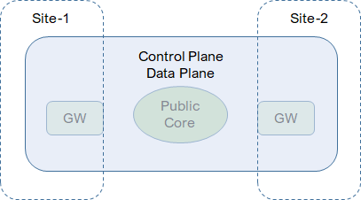
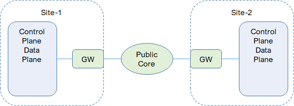
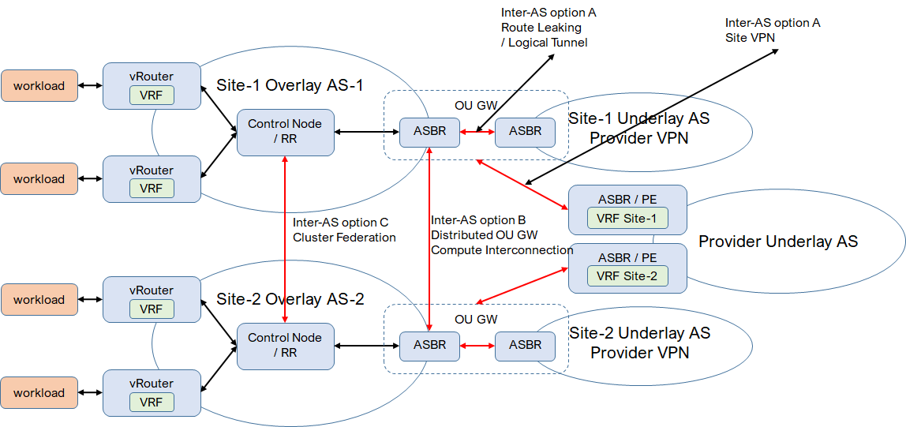

* [TOC](Multi-Site.md#toc)

# 1 Overview

In this guide, a site is an isolated environment that requires gateway to connect to other sites. A site could be a rack, a zone, a POP, or a geographically distributed office or DC.

Depends on the use case (which component on a site), connectivity is provided on 3 components with 2 options for each component.

* Compute (single cluster/brain)
  * Extension with centralized control node and OU-GW
  * Interconnection with separated control nodes and distributed OU-GW
* Fabric (single cluster/brain)
  * Extension with centralized control node and OU-GW
    * Centralized L3 GW (CRB)
    * Distributed L3 GW (ERB)
  * Interconnection with separated control nodes and distributed OU-GW
    * Centralized L3 GW (CRB)
    * Distributed L3 GW (ERB)
* Cluster (multiple clusters/brains)
  * Extension/Federation
  * Interconnection

Here are the logical roles. A logical role is placed on supported device.
* L2GW, connects BMS to L2, on QFX leaf.
* L3GW, does L3 routing for BMS, on QFX leaf, QFX spine or MX.
* OU-GW, overlay-underlay gateway, on QFX spine or MX.

## 1.1 Extension
* With centralized control node, control plane and data plane for overlay are extended across multiple sites.
* Site gateway and public core provides underlay connectivity and is transparent to overlay.
* Tunnels on data plane and BGP connections on control plane goes through site gateway and public core and established directly between components.

## 1.2 Interconnection
* With separated control nodes, control planes and data planes for overlay are isolated between sites.
* Components on control plane and data plane are connected via gateway.
* Tunnels on data plane are terminated on gateway, does not go through public core.
* BGP peering is between control components and gateway.

## 1.3 Control plane

