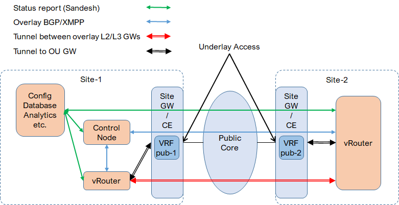
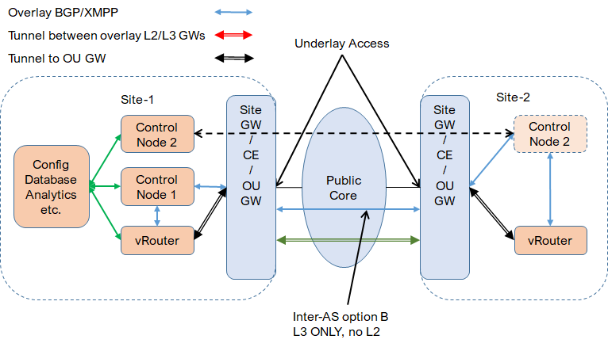

* [TOC](Multi-Site.md#toc)

# 2 Compute

This is also called remote compute. In this case, the cluster is deployed on the primary site. Compute nodes (vrouters) are deployed on primary site and multiple remote/secondary sites.

## 2.1 Compute extension

With this option, both control plane and data plane are extended across multiple sites by site gateway and public network. On the control plane, the vrouter in all remote sites have XMPP connections to the controller on primary site. On the data plane, tunnel is established between vrouters and goes through site gateway and public network.

* Site gateway and public network are transparent to overlay. No need to manage site gateway for overlay connectivity, only for public access (overlay-underlay).

* Both L2 and L3 connectivity is supported across sites.

* It's easier to deploy and manage.

* Overlay traffic is in tunnel and going through public network. It's difficult for public network to apply traffic engineering to overlay traffic. The tunnel may also cause MTU issue on public network.

* A separated virtual network for public access is required for each site and extended to site gateway.

This option may be more suitable to enterprise customers who don't own public network, focus on the connectivity between sites.

## 2.2 Compute interconnection

With this option, control plane and data plane are not extended. They are interconnected by site gateway. On the control plane, there is speparated control node for each site, BGP peering with the site gateway. All control nodes are located on primary site. On the data plane, overlay tunnel is terminated on site gateway.

* Overlay tunnel is terminated on site gateway. Traffic engineering can be applied on overlay traffic by service provider.

* Only L3 connectivity is supported, L2 is not.

* Site gateways have to be managed to BGP peer with controller and terminate overlay tunnel.

* Separated control node is required for each site.

This options may be more suitable to service provider customers who own public network, provide network service and require overlay-underlay connectivity.

