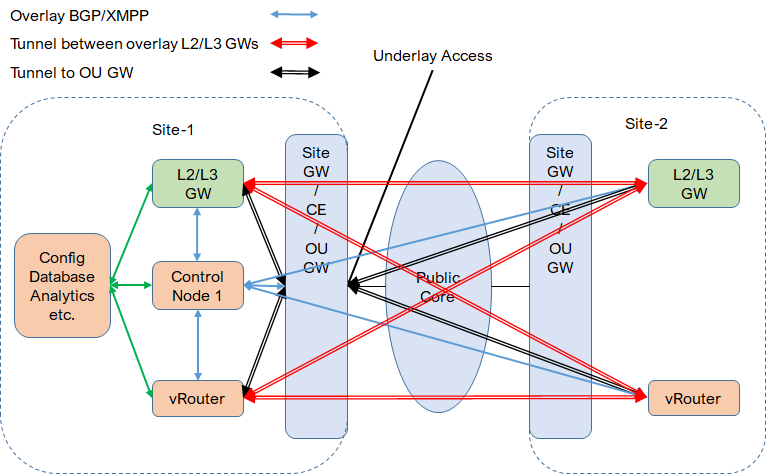
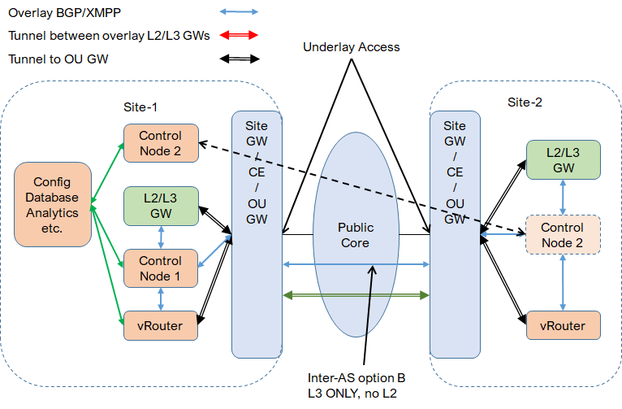

* [TOC](Multi-Site.md#toc)

# 3 Fabric

In this case, the cluster is deployed on the primary site. Fabric (L2GW and L3GW) are deployed on primary site and multiple remote/secondary sites.

## 3.1 Fabric extension

Here are 2 options for BMS L3 GW, centralized or distributed.
* With centralized L3 GW, all L3 routing including remote site is done on centralized L3 GW. It causes traffic detour.
* With distributed L3 GW, L3 routing on each site is done by local L3 GW. But due to the single control node, to avoid L3 routing loadbalancing, L3 and L2 GWs have to stay together (ERB).

## 3.2 Fabric interconnection

Separated control nodes are required to support distributed OU-GW and L3 GW. Either ERB or CRB works.

