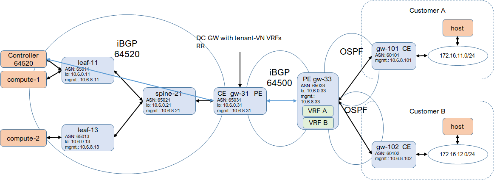
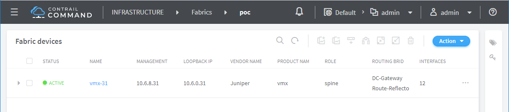
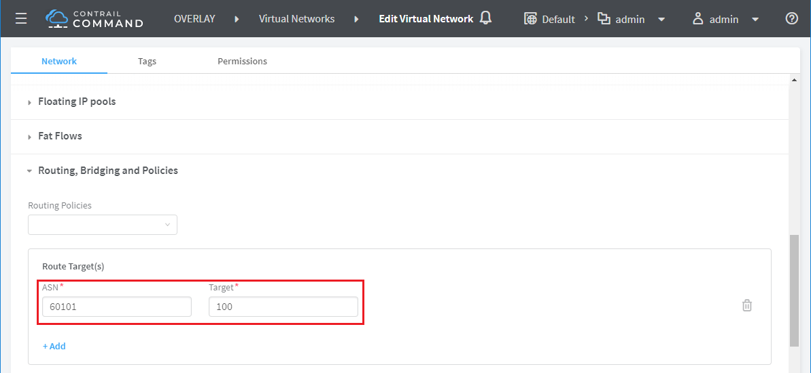
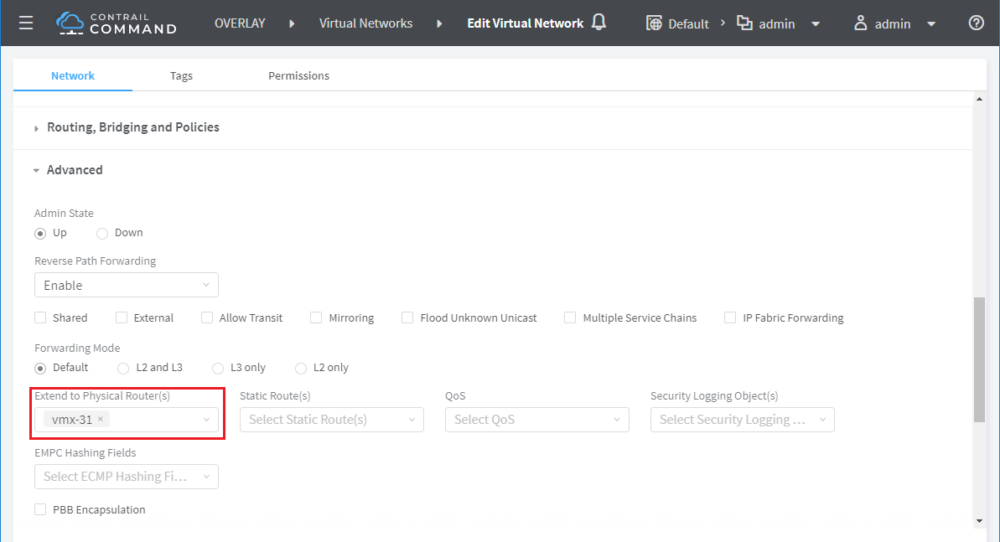
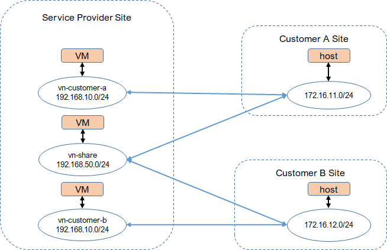
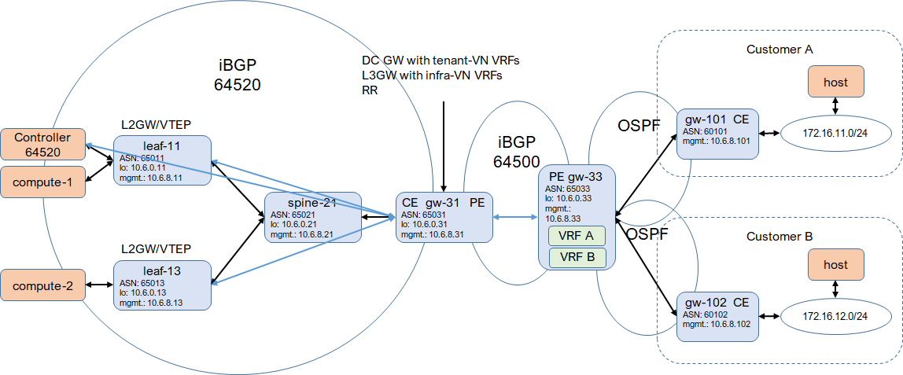
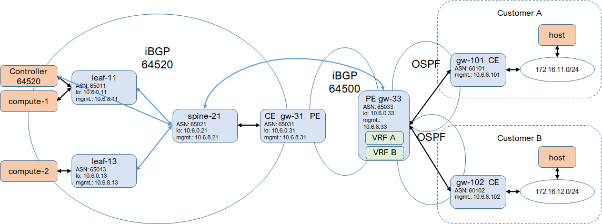

* [TOC](Multi-Site.md#toc)

# 5 Deployment VPN

* This deployment is for service provider to expose virtual network to customer who is connected by L3VPN. L2 connectivity (intra-subnet) is not enabled. Very a few services require L2. L2 to service provider overlay may increase security concerns.
* Multi-tenancy is supported. Address overlapping is supported for customers. Virtual network for different customer is isolated.
* This deployment is in a virtual environemnt with vQFX (19.4R1.10) as leaf and spine, and vMX (19.4R1.10) as gateway.

* `gateway` is a logical role. It can be on physical site gateway or physical spine switch.
* In service provider site, the underlay is the typical IP CLOS fabric. Every leaf and site gateway connects (eBGP peer) to all spines. The site gateway is as both CE and PE.
* For small service provider site, the gateway could be on the spine as well. An aggregation layer between leaf and spine/gateway is optional.
* For customer site, to simplify the deployment, host connects to gateway/CE directly. CE peers to PE with OSPF.
* In the service provider core, IGP (OSPF in this case) is used to connect all routers to provide underlay connectivities between PEs.
* Based on the underlay connectivity in the core, iBGP peering is established on all PEs via route reflectors in the core.
* Remote PE holds VRFs, one for each customer site, to provide VPN.
* A VRF is configured on remote PE for each customer site. An unique route target is allocated to each customer site for route import and export.
* In service provider site, Contrail control node (BGP node) peers to gateways with iBGP. Gateways are also route reflectors in different clusters.

## 5.1 Infra-underlay

* No infra-overlay, all infra-networks on underlay (vrouter on underlay) will avoid any issues or concerns caused by VXLANoVXLAN.
* Multi-homing can be supported by MC-LAG.
* There is no L2GW/VTEP or L3GW.
* Leaf and spine are for underlay connectivity only.
* For tenant-overlay, Contrail control node peers to site gateway with iBGP.
* Tenant virtual networks are extended to site gateway. Tenant VRFs are on site gateway.

### 5.1.1 Deployment configuration

* [Configuration on leaf-11](A1-Deployment-VPN.md#a111-leaf-11-configuration)
* [Configuration on spine-21](A1-Deployment-VPN.md#a112-spine-21-configuration)
* [Configuration on gw-31](A1-Deployment-VPN.md#a113-gw-31-configuration)
* [Configuration on gw-33](A1-Deployment-VPN.md#a114-gw-33-configuration)
* [Configuration on gw-101](A1-Deployment-VPN.md#a115-gw-101-configuration)
* [Configuration on gw-102](A1-Deployment-VPN.md#a116-gw-102-configuration)

### 5.1.2 Workflow

#### Create fabric

For Contrail to manage devices, on Contrail Command, create a fabric by importing the gateway only. The role is `spine`, `DC-Gateway` and `Route-Reflector`. Contrail will configure the gateway to establish iBGP peering.

#### Virtual network

To expose a virtual network to customer, create a virtual network with customer route target and extend the virtual network to the gateway. Contrail will configure the gateway to create a VRF for that virtual network. Multi-tenancy is supported. Virtual networks exposed to different customers will be isolated. The same virtual network can also be shared by multiple customers.

* Create virtual network `red-customer-a` with route target of customer A.
* Create virtual network `red-customer-b` with route target of customer B.
* Both above virtual networks have the same address space and are isolated.
* Create virtual network `share-a-b` with route targets of both customer A and B.

#### Note
1. MPLSoUDP is not supported by vMX properly. When test ping from VM to customer site, request always goes through. But only the first response packet is sent back to vrouter. So change it to MPLSoGRE, which works fine. It should work fine with physical MX.
2. Remove `accept` from export policy `mpls_over_udp`, otherwise, the next policy won't be evaluated. This can be fixed by patching template.

* [Configuration pushed by Contrail on gw-31](A1-Deployment-VPN.md#a117-gw-31-configuration) with the fix to address the above notes

### 5.1.3 Connectivity

Route from customer site will be propagated and imported to virtual network. When launch a VM on the virtual network, VM route will be advertised to the CE on customer site. VM and host on customer site are connected.

* Launch `vm-red-customer-a` on virtual network `red-customer-a`. It can reach customer A site.
* Launch `vm-red-customer-b` on virtual network `red-customer-b`. It can reach customer B site.
* Launch `vm-shared` on virtual network `share-a-b`. It can reach both customer A and B sites.

* [route tables on gw-31](A1-Deployment-VPN.md#a118-gw-31-route-table)
* [route tables on gw-33](A1-Deployment-VPN.md#a119-gw-33-route-table)
* [route tables on gw-101](A1-Deployment-VPN.md#a1110-gw-101-route-table)
* [route tables on gw-102](A1-Deployment-VPN.md#a1111-gw-102-route-table)

## 5.2 Infra-overlay with gateway on site gateway

* With infra-overlay, all infra-networks on overlay (vrouter on overlay).
* Multi-homing is supported by EVPN-VXLAN.
* L2GW is on leaf and L3GW is on site gateway. This is for small or medium site who doesn't have spine or has lean spine only.
* For infra-overlay and tenant-overlay, Contrail control node and leaf peer to site gateway with iBGP.
* Infra and tenant virtual networks are extended to site gateway. Infra and tenant VRFs are on site gateway.

### 5.2.1 Deployment configuration

* [Configuration on leaf-11](A1-Deployment-VPN.md#a121-leaf-11-configuration)
* [Configuration on spine-21](A1-Deployment-VPN.md#a122-spine-21-configuration)
* [Configuration on gw-31](A1-Deployment-VPN.md#a123-gw-31-configuration)
Configuration on `gw-33`, `gw-101` and `gw-102` is the same as 5.1.1.

#### Note
Infra-overlay configuration on `leaf-11` and `gw-31`, in this case, is configured by Contrail, with manual fixes.
1. Move IRB from VRF to master RI for the connectivity between data network and underlay.
2. Updat IRB address and make vitual gateway address accept data.
3. Due to the limit of vMX, change MPLSoUDP to MPLSoGRE.

### 5.2.2 Workflow

The workflow is the same as 5.1.2.

* [Configuration pushed by Contrail on gw-31](A1-Deployment-VPN.md#a124-gw-31) with the fix to address the above notes

### 5.2.3 Connectivity

The connectivity is the same as 5.1.3.

## 5.3 Infra-overlay with gateway on spine

* With infra-overlay, all infra-networks on overlay (vrouter on overlay).
* Multi-homing is supported by EVPN-VXLAN.
* L2GW is on leaf and L3GW is on spine. This is for large site deployment where spine is powerful to handle EVPN-VXLAN routing.
* For infra-overlay and tenant-overlay, Contrail control node and leaf peer to spine with iBGP.
* Spine will peer with core directly. Site gateway provides underlay connectivity only.
* Infra and tenant virtual networks are extended to spine. Infra and tenant VRFs are on spine.

### 5.3.1 Deployment configuration

### 5.3.2 Workflow

### 5.3.3 Connectivity

