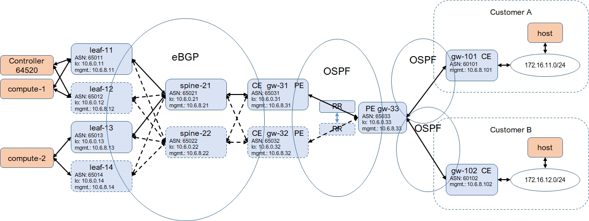
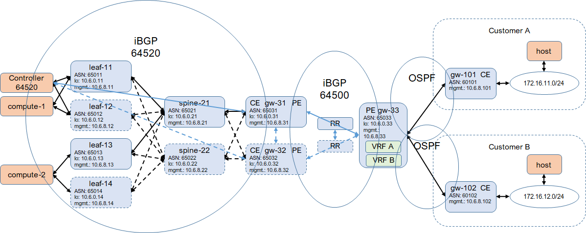
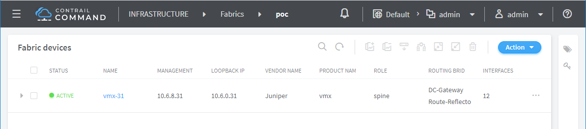
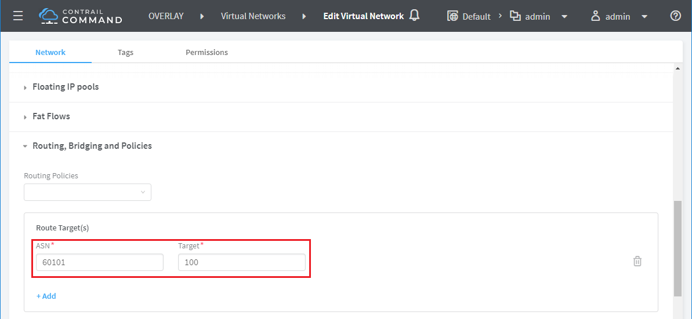
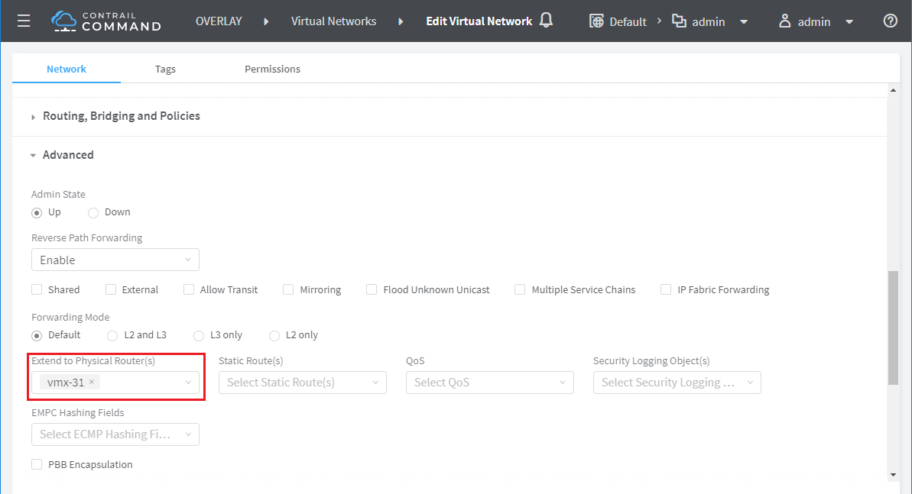
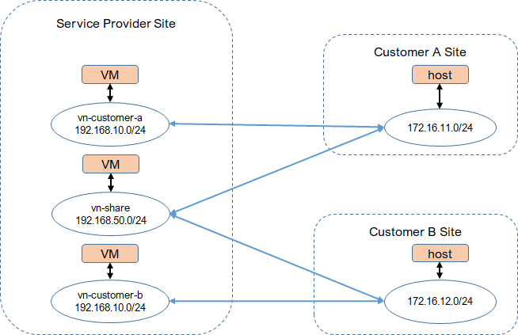

* [TOC](Multi-Site.md#toc)

# 5 Deployment VPN

* This deployment is for service provider to expose virtual network to customer who is connected by L3VPN. L2 connectivity (intra-subnet) is not enabled. Very a few services require L2. L2 to service provider overlay may increase security concerns.
* Multi-tenancy is supported. Address overlapping is supported for customers. Virtual network for different customer is isolated.
* EVPN-VXLAN based multi-homing is not enabled as for now. It should make no difference. It could be validated later.
* BMS and SRIOV is not supported with this deployment.
* This deployment is in a virtual environemnt with vQFX (19.4R1.10) as leaf and spine, and vMX (19.4R1.10) as gateway.

## 5.1 Underlay

* In service provider site, every leaf and gateway connects (eBGP peer) to all spines to build CLOS fabric underlay. The site gateway is as both CE and PE.

* For customer site, to simplify the deployment, host connects to gateway/CE directly. CE peers to PE with OSPF.

* In the service provider core, IGP (OSPF in this case) is used to connect all routers to provide underlay connectivities between PEs.

* Based on the underlay connectivity in the core, iBGP peering is established on all PEs via route reflectors in the core.

## 5.2 VPN and overlay

* Remote PE holds VRFs, one for each customer site, to provide VPN.

* A VRF is configured on remote PE for each customer site. An unique route target is allocated to each customer site for route import and export.

* In service provider site, Contrail control node (BGP node) peers to gateways with iBGP. Gateways are also route reflectors in different clusters.

* [Configuration on leaf-11](A1-Deployment-VPN.md#a111-leaf-11)
* [Configuration on spine-21](A1-Deployment-VPN.md#a112-spine-21)
* [Configuration on gw-31](A1-Deployment-VPN.md#a113-gw-31)
* [Configuration on gw-33](A1-Deployment-VPN.md#a114-gw-33)
* [Configuration on gw-101](A1-Deployment-VPN.md#a115-gw-101)
* [Configuration on gw-102](A1-Deployment-VPN.md#a116-gw-102)

## 5.3 Workflow

### 5.3.1 Fabric

For Contrail to manage devices, on Contrail Command, create a fabric by importing the gateway only. The role is `spine`, `DC-Gateway` and `Route-Reflector`.

### 5.3.2 Virtual network

To expose a virtual network to customer, create a virtual network with customer route target and extend the virtual network to the gateway. Contrail will push configuration to create a VRF for that virtual network. Multi-tenancy is supported. Virtual networks exposed to different customers will be isolated. The same virtual network can also be shared by multiple customers.

* Create virtual network `red-customer-a` with route target of customer A.
* Create virtual network `red-customer-b` with route target of customer B.
* Both above virtual networks have the same address space and are isolated.
* Create virtual network `share-a-b` with route targets of both customer A and B.

#### Note
1. MPLSoUDP is not supported by vMX properly. When test ping from VM to customer site, request always goes through. But only the first response packet is sent back to vrouter. So change it to MPLSoGRE, which works fine. It should work fine with physical MX.
2. Remove `accept` from export policy `mpls_over_udp`, otherwise, the next policy won't be evaluated. This can be fixed by patching template.

* [Configuration pushed by Contrail on gw-31](A1-Deployment-VPN.md#a121-gw-31) with the fix to address the above notes

### 5.3.3 Connectivity

Route from customer site will be propagated and imported to virtual network. When launch a VM on the virtual network, VM route will be advertised to the CE on customer site. VM and host on customer site are connected.

* Launch `vm-red-customer-a` on virtual network `red-customer-a`. It can reach customer A site.
* Launch `vm-red-customer-b` on virtual network `red-customer-b`. It can reach customer B site.
* Launch `vm-shared` on virtual network `share-a-b`. It can reach both customer A and B sites.

* [route tables on gw-31](A1-Deployment-VPN.md#a131-gw-31)
* [route tables on gw-33](A1-Deployment-VPN.md#a132-gw-33)
* [route tables on gw-101](A1-Deployment-VPN.md#a133-gw-101)
* [route tables on gw-102](A1-Deployment-VPN.md#a134-gw-102)

