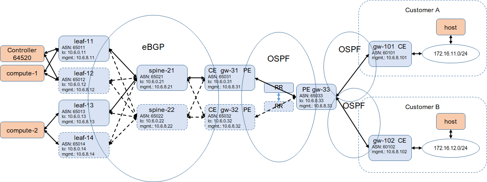

* [TOC](Multi-Site.md#toc)

# 5 Deployment example 1

* For service provider, each site gateway is both CE and PE.
* Address space for each site is pre-allocated without overlapping.
* No EVPN-VXLAN based multi-homing to avoid troubles may caused by VXLANoVXLAN for VM on vrouter. MC-LAG is an option.
* vQFX (19.4R1.10) is as leaf and spine, and vMX (18.3R1.9) is as gateway.

## 5.1 Underlay

In each site, every leaf and gateway connects (eBGP peer) to all spines to form the CLOS fabric underlay. For small site without spine, every leaf connects to all gateways. Each device has an unique underlay ASN.

In the service provider core, IGP (OSPF in this case) is used to connect all routers to provider underlay connectivities between site gateways.

Based on the underlay connectivity in the core, iBGP peering is established on all gateways via route reflectors in the core. Connectivity between sites is provided by this iBGP.

Eventually, this underlay provides connectivity between the controller on primary site and compute on other sites.

## 5.2 Overlay

