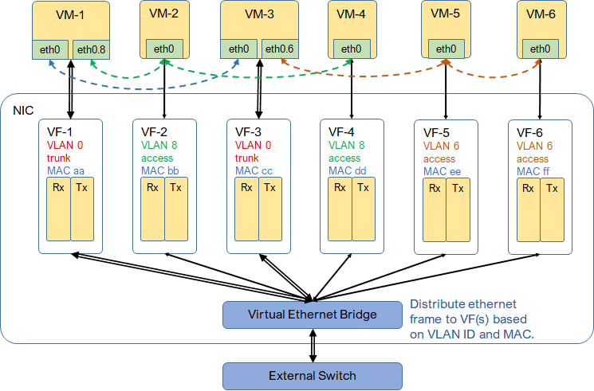

* [TOC](SRIOV.md)

# 1 Overview

With SRIOV, multiple virtual functions are provided by NIC. Each VF is made a PCI device to kernel by device driver. With PCI passthrough, direct and exclusive access to PCI device is provided by hypervisor to virtual machine.

## 1.1 VF

VF is essentially a pair of tx/rx queues. VLAN ID and MAC have to be configured on each VF. When VLAN ID is 0, VF is in trunk mode. Otherwise, VF is in access mode.

In access mode, VF takes untagged frame only from VM. VLAN is not allowed to be enabled inside VM. Frame will be tagged with VLAN ID and transmitted. From VEB, VF takes tagged frame, untags it and transmit to VM.

In trunk mode, VF takes both tagged and untagged frames from VM. Frame will be transmitted as is. It's the same on reversed path from VEB.

## 1.2 VEB

Virtual ethernet bridge is like regular ethernet L2 switch to connect all VFs and external port, and distribute frames between them, based on MAC and VLAN ID.

Broadcast frame is distributed to all trunk VFs, matched access VFs and external port. Unicast frame is distributed to the port matching MAC address.

