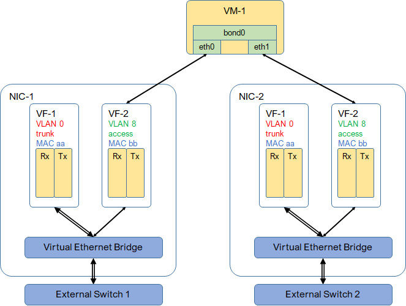

* [TOC](SRIOV.md)

# 5 Multi-homing

* Boost bandwidth and provide redundancy.
* A VM has two interfaces on two VFs from two different PFs.
* Two PFs connect to two devices.
* Bonding interface can be configured inside VM.
* Both tagged and untagged traffic is supported.

## 5.1 Workflow to launch VM

Here are the steps to launch a VM with multi-homing.

#### 1. Create two VM ports.
For access. two ports are on the tenant VN. For trunk, two ports are on the trunk VN.

#### 2. Launch a VM on two ports.
Nova compute will allocate VFs from physical network (PF), assign VLAN ID and set MAC address on each VF.

#### 3. Find out device and port.
Run a script on the compute node where VM is launched to find out the device and port that each PF connects to.

Given the port MAC address, which is set on VF, the script finds out PF. Device and port can retrieved from LLDP neighbor of PF.

#### 4. Create VPG.
A virtual port group is created and referred by two physical interfaces (device port). An aggregated interface will be built on those two ports.

#### 5-1. Untagged traffic from VM.
Create a VM port on tenant VN to configure device. This port contains device info for Contrail to configure device. It also has native-vlan-id for untagged traffic. Only one trunk port is allowed on each PF.

#### 5-2. Tagged traffic from VM.
Create a VM port on tenant VN to configure device. This port contains device info for Contrail to configure device.

#### 6. Configure device.
Once the port is created, device manager service in Contrail will start a workflow to configure device.

