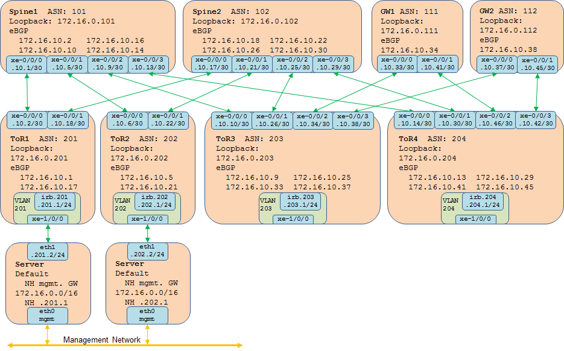

# 1 Overview

Contrail requires IP reachability on underlay. CLOS IP fabric is recommended as the underlay.

# 2 CLOS IP fabric

* ToR/Leaf

    ToR is the switch on top of each rack. It's the gateway of the rack subnet/VLAN. It peers with all spines by BGP.

* Spine

    Each spine peers with all ToRs by BGP. They provide the connectivity between racks. At least 2 spines are required for redundancy purpose.

* Gateway

    This is the gateway connecting overlay and underlay. I could be the DC gateway. There normally at least 2 gateways to provide redundancy and support multiple service providers. Unless there is bandwidth requirement on gateway, they normally connect to ToR which port is less expensive than the port on spine.

# 3 Server

Each server on the rack connects to isolated management network and data network.

* Single ToR switch

    For POC or lab, servers can connect to single ToR switch.

* Virtual chassis

    For prouction that requires redundancy, virtual chassis can be enabled on top of multiple ToR switches. Each server connects to all ToR switches and those links forms bonding interface in the server.

* Multi-homing

    In case virtual chassis is not supported for multiple ToR switches, multi-homing has to be enabled. The gateway address of the rack subnet/VLAN will be the VIP on the IRB interface on all switches supported by VRRP.

